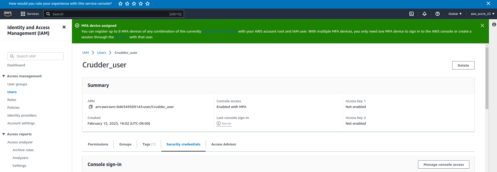
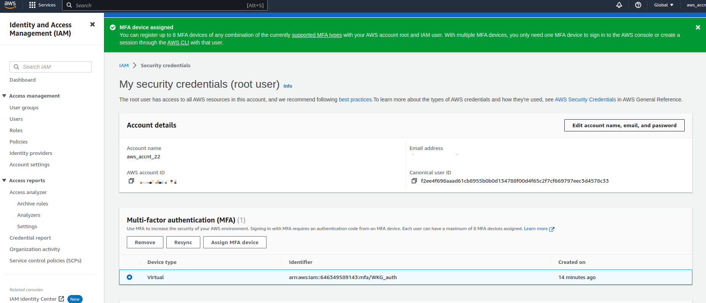
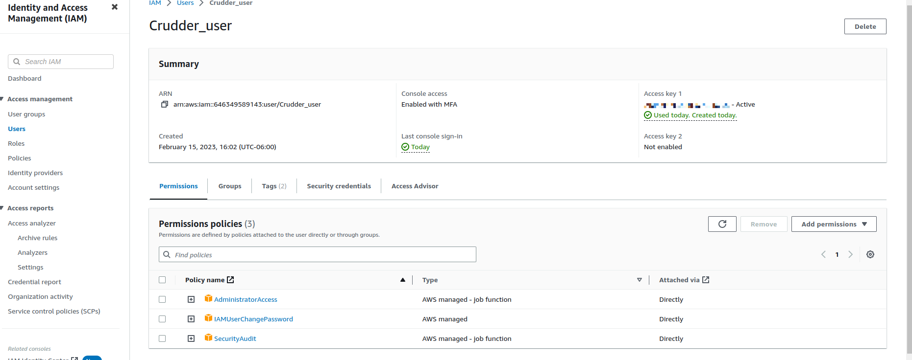
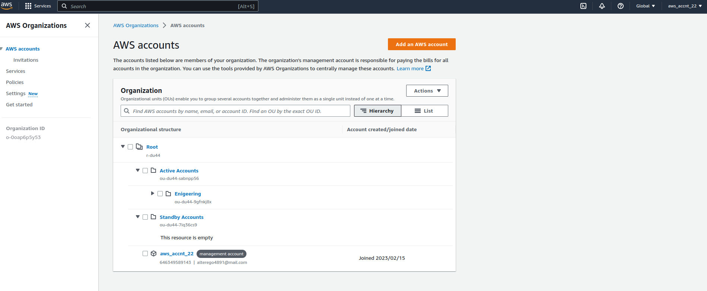
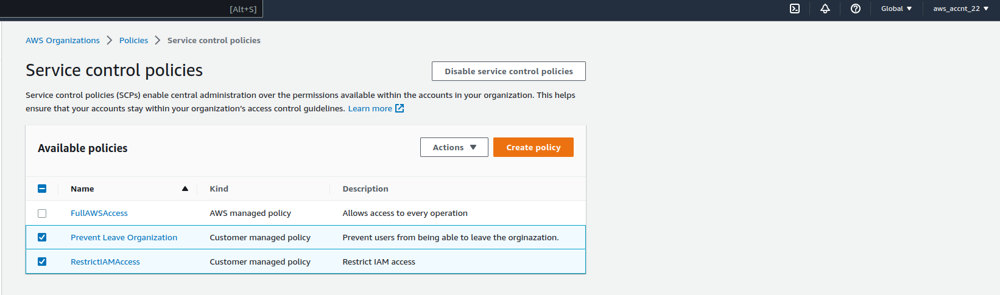
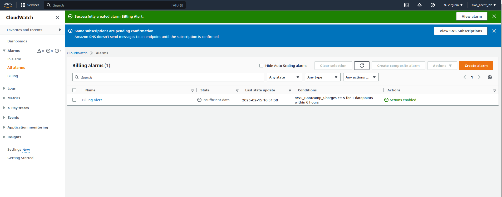
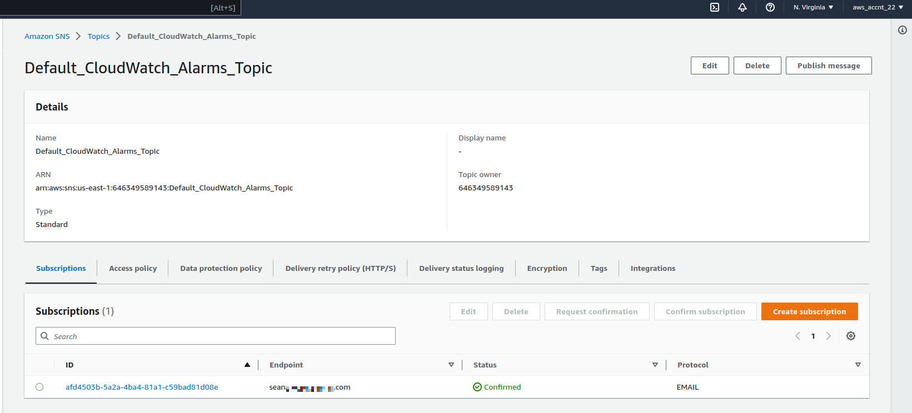
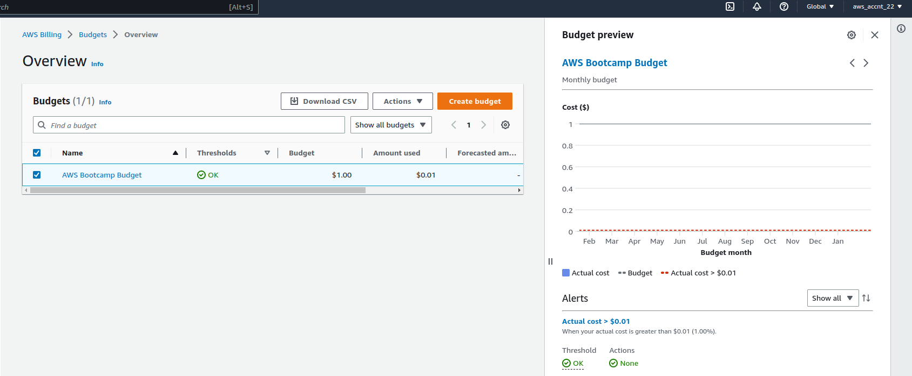
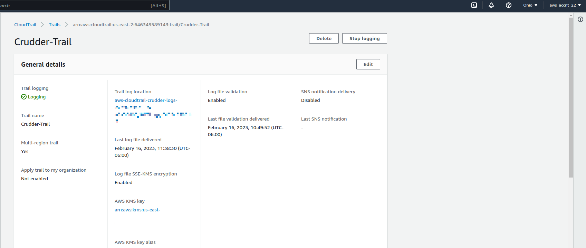
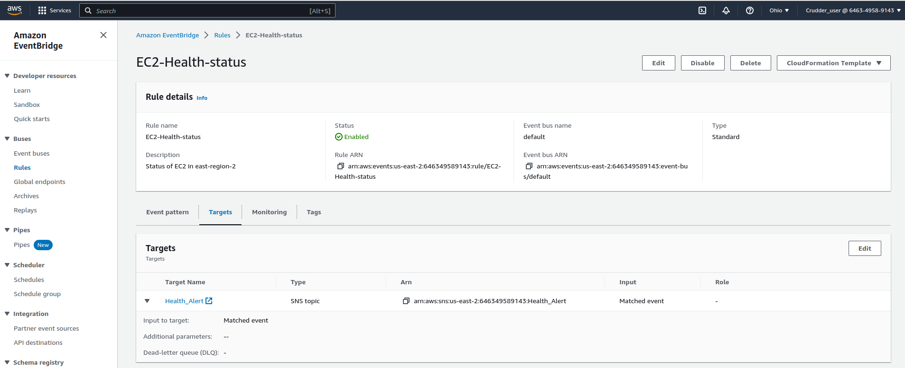

# Week 0 Billing and Architechture

### Diagrams 

[Logical Diagram](https://lucid.app/lucidchart/044d54be-c09b-4c09-a18f-f1ddf1b44387/edit?viewport_loc=-221%2C13%2C2261%2C1116%2C0_0&invitationId=inv_04dab94d-d5c4-4b5d-b7eb-eaa960765da1)

[Architectural Diagram](https://lucid.app/lucidchart/ec7097f7-4001-4f8b-999c-3e8081fcba10/edit?viewport_loc=-116%2C11%2C2261%2C1116%2C0_0&invitationId=inv_cef4b7df-11ee-41a9-8785-39c3bade6d48)

###  User setup

MFA was created for IAM 




and *__the ROOT account__*



Created IAM user with Admin access, the ability to change their own password, and a *__security audit policy__* to track the users activity.




Created *__organizations__* to manage any future accounts



Created two *__Service Control Policies (SCP)__* for an extra layer of security. The first prevents an account from removing itself from a organization and the second restricts IAM access.



### System Setup

AWS CLI installation can be found in the .gitpod.yml file

```
tasks:
  - name: aws-cli
    env:
      AWS_CLI_AUTO_PROMPT: on-partial
    init: |
      cd /workspace
      curl "https://awscli.amazonaws.com/awscli-exe-linux-x86_64.zip" -o "awscliv2.zip"
      unzip awscliv2.zip
      sudo ./aws/install
      cd $THEIA_WORKSPACE_ROOT
```

Check the status of the aws cli with gitpod
```
aws sts get-caller-identity
```

Output
```
{
    "UserId": "AIDAZM7LQBKLVCVL2P...",
    "Account": "646349589...",
    "Arn": "arn:aws:iam::646349589143:user/Crudder_user"
}
```

### Monitoring

Billing alarms were created when price is at or above $1.00



SNS topic was created to receive the billing alarm


Budget is set at $1.00 and uses te ZeroBudget template


*__CloudTrail__* was set up to record the API calls in AWS and store the log files in an S3 Bucket



### Challenges

[CI/CD Architectural Diagram](https://lucid.app/lucidchart/19a3aca2-8157-406d-a03c-b5e9d1d2c3c1/edit?viewport_loc=-268%2C-31%2C2261%2C1116%2C0_0&invitationId=inv_a18fe3aa-726c-4104-bba0-a6e70c66923e)


EC2 Health alert was created for the us-east-2 region with AWS eventbridge used to monitor EC2 heatlh and a SNS topic to notify me by email of the changes



### References

[Health Update](https://docs.aws.amazon.com/health/latest/ug/cloudwatch-events-health.html)

[CI/CD Diagram](https://github.com/acantril/learn-cantrill-io-labs/tree/master/aws-codepipeline-catpipeline)


