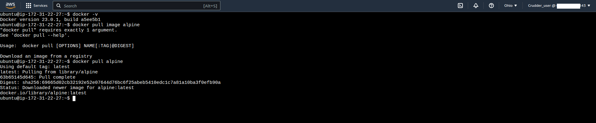

# Week 1--App Containerization

## Objectives 

The goal of this week was to create contianers for the Cruddur app so it may be easier to deploy as a set of microserices on AWS.  We used Docker to do this as it allow us to create a series of independent environments that will work the same way on any platform that has docker installed.

Docker and Docker compose comes pre-installed on the Gitpod app along with the Docker extensions of Vscode. The only thing that was required was to create the images for the frontend and backend of the app with Dockerfiles.

### Backend Container Setup

The backend is a python flask app that is pulled from Dockerhub and listens of port:4567.
The [Backend Dockerfile](https://github.com/seanware/aws-bootcamp-cruddur-2023/blob/main/backend-flask/Dockerfile) is based on a python-slim image and installs the requirements.txt file to load flask and any other libraries

Once the backend Dockerfile was created container image named backend-flask was built by running.
```bash
docker build -t  backend-flask ./backend-flask
```

It was difficult setting the environment variables when running the docker commands but 
eventually we found the correct input.
```bash
docker run --rm -p 4567:4567 -it -e FRONTEND_URL='*' -e BACKEND_URL='*' -d backend-flask
```

### Frontend Container Setup

The FRONTEND_URL='*' was necessary because the backend of the app need to be able to communicate with the frontend.

The frontend end is a react app the requires node package manager to be installed in the folder before being able to create the image.  This is neccesary for the app to expose its port and the code needed is below.

```bash
npm i
```
The [Frontend Dockerfile](https://github.com/seanware/aws-bootcamp-cruddur-2023/blob/main/frontend-react-js/Dockerfile) is based on a node16.18 image, installs npm so react and other libraries can be installed and exposes port 3000

After creating the Frontend Dockerfile and image name frontend-react-js was created with the following commands
```bash
docker build -t frontend-react-js ./frontend-react-js
```

We ran the frontend contianer in the backgroud with the following command
```bash
docker run -p 3000:3000 -d frontend-react-js
```
The -d flag causes the process to run in the background

### Running Multiple Containers with Docker Compose

Since we have multiple containers running for the same app it makes sense to use Docker compose to build the images and launch and run the containers.  Doing this requies creating and [docker-compose.yml](https://github.com/seanware/aws-bootcamp-cruddur-2023/blob/main/docker-compose.yml) file in the root directory of this app.

The environment variables are set in the yaml file and all that is needed to run the app is to run one command
```bash
docker compose up
```

While interacting with the application it is important to make sure the ports for the frontend and backend are made publicly available and this is easily accomplished in Gitpod using the ports tab.

### Adding Data storage to the app

A useful application requires data persistence and we accomplished this by using postgreSQL as the backend storage and a local image of dynamoDB for the frontend to be used for development. We install these with docker compose and we are using base images for these two containers so we do not need separate dockerfiles for each.


Creating a DynamoDB local image
```yaml
dynamodb-local:   
    user: root
    command: "-jar DynamoDBLocal.jar -sharedDb -dbPath ./data"
    image: "amazon/dynamodb-local:latest"
    container_name: dynamodb-local
    ports:
      - "8000:8000"
    volumes:
      - "./docker/dynamodb:/home/dynamodblocal/data"
    working_dir: /home/dynamodblocal

```

Creating a postgres image
```yaml
db:
    image: postgres:13-alpine
    restart: always
    environment:
      - POSTGRES_USER=postgres
      - POSTGRES_PASSWORD=password
    ports:
      - '5432:5432'    
    volumes: 
      - db:/var/lib/postgresql/data
```

We built the images and ran the app by using
```bash
docker compose up
```
We installed the postgres client to be able to interact with the database by adding a task to our gitpod.yml file

```yaml
- name: postgres
    init: |
      curl -fsSL https://www.postgresql.org/media/keys/ACCC4CF8.asc|sudo gpg --dearmor -o /etc/apt/trusted.gpg.d/postgresql.gpg
      echo "deb http://apt.postgresql.org/pub/repos/apt/ `lsb_release -cs`-pgdg main" |sudo tee  /etc/apt/sources.list.d/pgdg.list
      sudo apt update
      sudo apt install -y postgresql-client-13 libpq-dev
```

And we added a vscode extension
```yaml
- cweijan.vscode-postgresql-client2
```

The postgres container could have its installation verified by using
```bash
psql -U postgres --host localhost
```

### Enabling Notifications in the App

The app needs to have the notifications functonality added to it.  This is done by added a react js component to the frontend and a notification endpoint to the backend.

In the frontend application the app.js file needs to have a path for notifications as a route
```js
{
    path: "/notifications",
    element: <NotificationsFeedPage />
  },
```

Also a [notifications.js](https://github.com/seanware/aws-bootcamp-cruddur-2023/blob/main/frontend-react-js/src/pages/NotificationsFeedPage.js) feed page was created that displays the notifications on the frontpage of our app

On the backend and new route was created for the notifications endpoint in the app.py file
```python
@app.route("/api/activities/notifications", methods=['GET'])
def data_notifications():
  data = NotificationsActivities.run()
  return data, 200
```

And a new service needs to be created for the notifications endpoint which returns the json for the frontend. This functionality is located in the [notifications_activities.py](https://github.com/seanware/aws-bootcamp-cruddur-2023/blob/main/backend-flask/services/notifications_activities.py). 

### Document the API

We use OpenApi to document the endpoint because it is useful for creating documentation and standardizes the construction of API's across platforms.

To add the notifications to our api docementations we have to add the following to our OpenAPI file
```yaml
/api/activities/notifications:
    get:
      description: 'Return a feed of activity for all of those that I follower'
      tags:
         - activities
      parameters: []
      responses:
        '200':
          description: Returns an array of activities
          content:
            application/json:
              schema:
                type: array
                items:
                  $ref: '#/components/schemas/Activity'
```

### Security Recommendations

I ran [Snyk](https://snyk.io/) to scan the docker images for the frontend and the backend images and mutliple issues were found. The frontend images have 7 critical 16 high security issues.

This is due to the node image being out of date.
Node:16.19.0 is the current version and we are using node:16.18 and upgrade would reduce the vulnerabilites.

The backend image as 1 critical and 4 high vulnerabilites. 
 These would all disapper if we upgraded for python:3.10-slim-buster to python:3.12.0a5-slim

### Challenge Problems

*Startup Script*

Dockerfiles are able to have their CMD functions run via script.  I did this for the backend by using an Entrypoint command and a script named [start.sh](https://github.com/seanware/aws-bootcamp-cruddur-2023/blob/main/backend-flask/start.sh) to start the python backend.
```bash
ENTRYPOINT ["sh", "./start.sh"]
```

*Local Installation*

I installed Docker and Docker compose on my local machine which is running Linux Mint 21.1 using the following commands. [1](https://docs.docker.com/engine/install/ubuntu/)
```bash
sudo apt-get install docker-ce docker-ce-cli containerd.io docker-buildx-plugin docker-compose-plugin
```
And running docker 
```bash
sudo docker run hello world
```

Docker needs the sudo command because by default on linux in runs as root.  However, this is not only annoying to run but also not secure as docker container should not be run as root.  A docker group needs to be added and the permissions need to be changed. [2](https://docs.docker.com/engine/install/linux-postinstall/)
```bash
sudo groupadd docker
sudo usermod -aG docker $USER
newgrp docker
```

Docker compose is a plugin that needs to be installed by creating a directory for the docker plugins and making those scripts executable.  [3](https://www.digitalocean.com/community/tutorials/how-to-install-and-use-docker-compose-on-ubuntu-22-04)
```bash
mkdir -p ~/.docker/cli-plugins/

curl -SL https://github.com/docker/compose/releases/download/v2.16.0/docker-compose-linux-x86_64 -o ~/.docker/cli-plugins/docker-compose

chmod +x ~/.docker/cli-plugins/docker-compose
```  

To run the application locally I had to change the ports to http://localhost:3000 for the frontend and http://localhost:4567 for the backend.

Running the command
```bash
docker compose up
```
It works as it did in gitpod and I was able to acess the backend endpoint

and the frontend 

*Healthchecks*

Is is important to know the status of the containers while they are running and monitoring can be done in Docker Compose as a version 3 with healthchecks. I added three healthchecks to the docker compose file.

Backend Check
```yaml
healthcheck:
      test: curl --fail "https://4567-${GITPOD_WORKSPACE_ID}.${GITPOD_WORKSPACE_CLUSTER_HOST}" || exit 1
      interval: 60s
      retries: 5
      start_period: 20s
      timeout: 10s
```

Frontend Check
```yaml
healthcheck:
      test: curl --fail "https://3000-${GITPOD_WORKSPACE_ID}.${GITPOD_WORKSPACE_CLUSTER_HOST}" || exit 1
      interval: 60s
      retries: 5
      start_period: 20s
      timeout: 10s
```

Postgres Check [4](https://github.com/peter-evans/docker-compose-healthcheck)
```yaml
healthcheck:
  test: ["CMD-SHELL", "pg_isready"]
  interval: 10s
  timeout: 5s
  retries: 5
```

*Remote Docker on EC2*

I was able to set up an EC2 instance, install docker on that instance and pull and linux image.  

I first created the image at the command line using AWS Cloudshell, which required me to find the VPC id, Subnet ID and Amazon Machine Image ID.  For the machine image I chose ubuntu linux because that operating system and common to other cloud providers and is similar to my local machine.

The first step in creating the image was creating a security group
```bash
aws ec2 create-security-group \
    --group-name d-sec \
    --description "Docker Demo" \
    --tag-specifications 'ResourceType=security-group,Tags=[{Key=Name,Value=docker-demo}]' \
    --vpc-id vpc-#########3069
```

Secondly, the ingress firewalls had to be put into place
```bash
aws ec2 authorize-security-group-ingress \
    --group-id sg-###########de0e \
    --protocol tcp \
    --port 22 \
    --cidr "0.0.0.0/0" 

```

Third, I created a key-pair
```bash
aws ec2 create-key-pair \
    --key-name dck-key \
    --key-type rsa \
    --key-format pem \
    --query "KeyMaterial" \
    --output text > dck-key.pem 

```

Finally, I created the instance
```bash
aws ec2 run-instances \
    --image-id ami-############73771\
    --count 1 \
    --instance-type t2.micro \
    --key-name dck-key \
    --security-group-ids sg-############de0e \
    --subnet-id subnet-############850f1 \
    --block-device-mappings "[{\"DeviceName\":\"/dev/sdf\",\"Ebs\":{\"VolumeSize\":30,\"DeleteOnTermination\":false}}]" \
    --tag-specifications 'ResourceType=instance,Tags=[{Key=Name,Value=docker-demo}]' 'ResourceType=volume,Tags=[{Key=Name,Value=docker-server-disk}]'
```

Once the instance was created I installed docker like I did on my local machine and pulled a linux alpine image.



### References
[1] https://docs.docker.com/engine/install/ubuntu/

[2] https://docs.docker.com/engine/install/linux-postinstall/

[3] https://www.digitalocean.com/community/tutorials/how-to-install-and-use-docker-compose-on-ubuntu-22-04

[4] https://github.com/peter-evans/docker-compose-healthcheck
