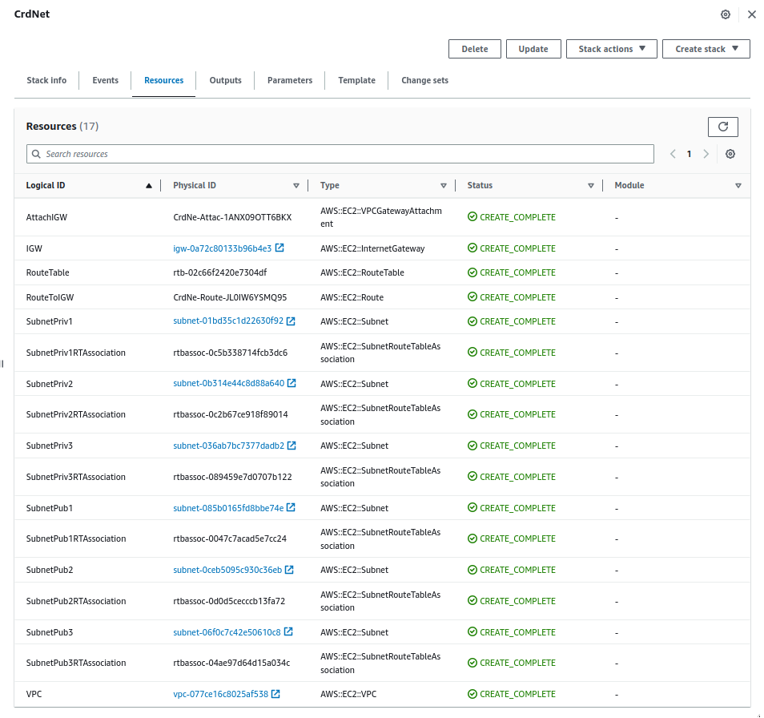
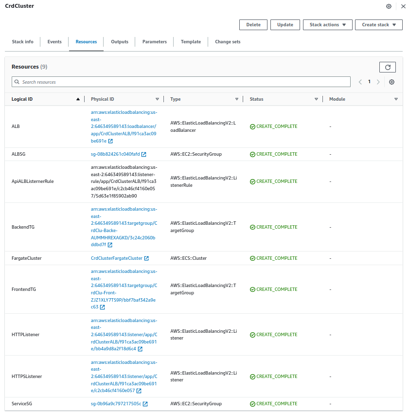
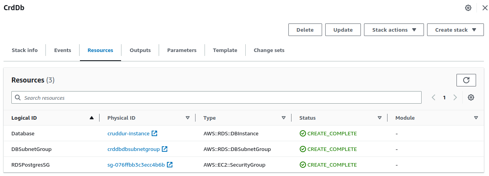
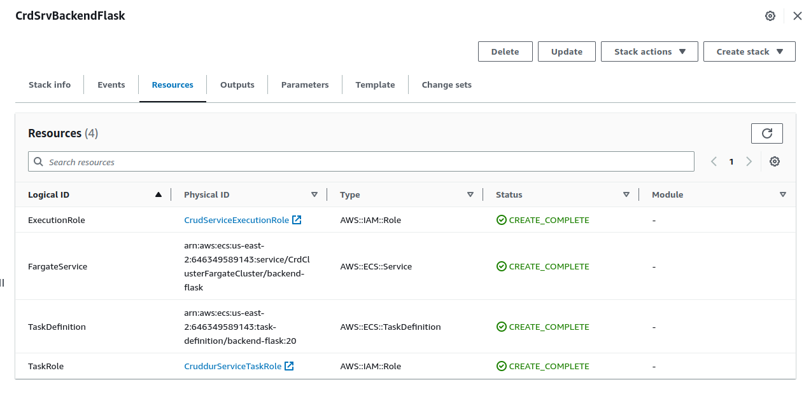
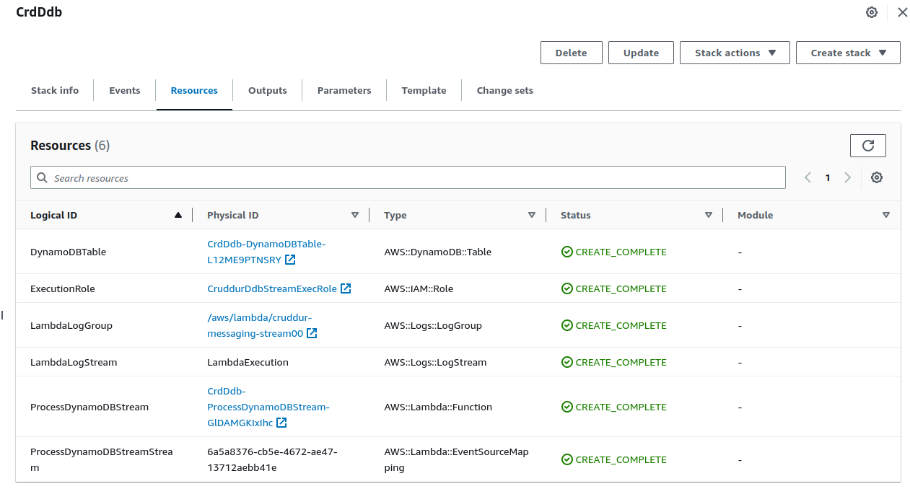
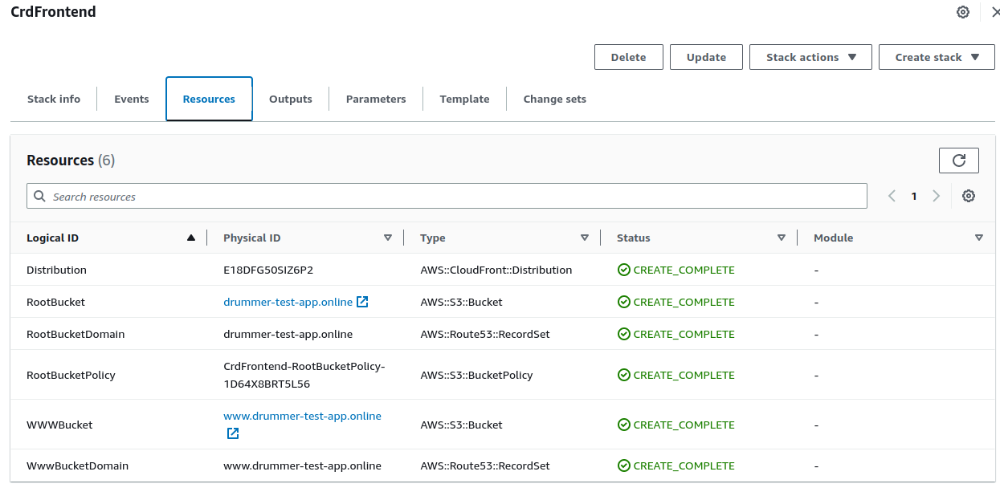
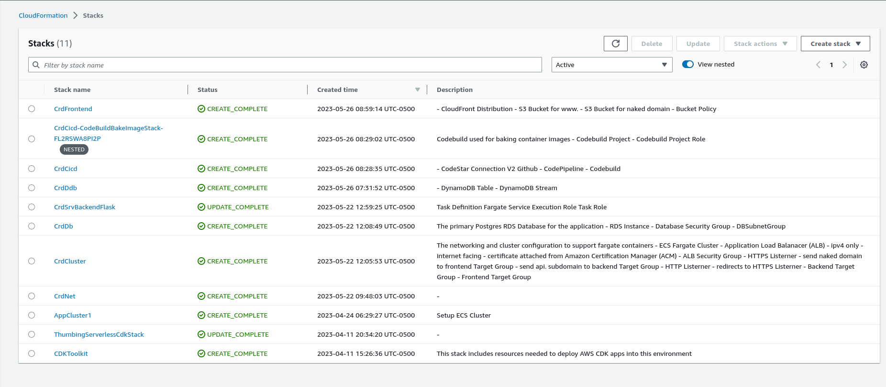
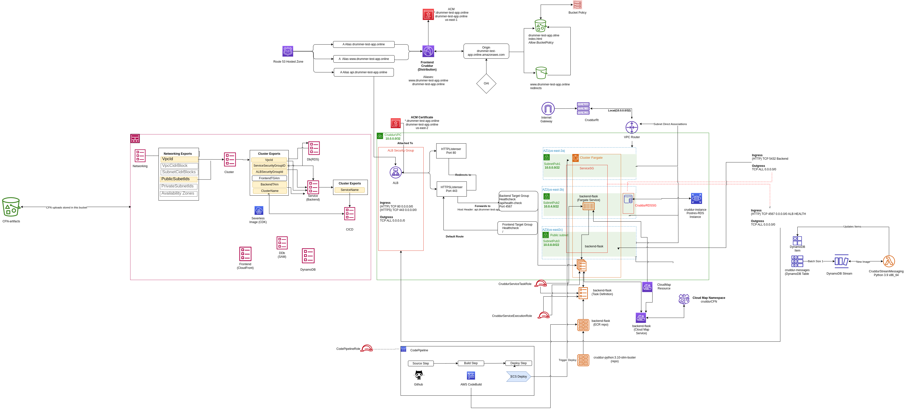

# Week 10 — CloudFormation 

### Topics

- [Intro](#intro)
- [Initial Setup](#initial-setup)
- [Linting and Validation](#linting-and-validation)
- [Networking](#networking)
- [CFN Cluster Layer](#cfn-cluster-layer)
- [Add Postgres RDS to the new VPC](#postgres-vpc)
- [Service Layer](#service-layer)
- [DynamoDB Streams CFN](#dynamodb-streams-cfn)
- [CICD CloudFormation](#cicd-cloudformation)
- [Static Frontend Hosting](#static-frontend-hosting)
- [Teardown](#teardown)
- [Diagram](#diagram)


### Intro
CloudFormation template does not change very often and is easier to maintain with code generation services.  AWS Manages the state of your infrastructure so you never lose your state file.  

CloudFormation is a YAML file that will be transformed to JSON which means you can use JSON in the file and it will still functions

Convert Fargate containers into CloudFormation YAML


### Initial Setup

Need AWS Cli installed to run CloudFormation

Path
aws/cfn

Three tier architecture design 
- Database Tier
- Web Tier
- Application Tier

Alternative Design
- Networking
- Database
- Application

Smaller and more composabale features

template.yaml

```yml
AWSTemplateFormatVersion: "2010-10-09"

Description: |
   Setup ECS Cluster
```

Because the templates don't change there are many sample use cases on the internet that remain correct.

Create the cluster with the logical name ECSCluster
```yml
Resources:
   ECSCluster: 
     Type: 'AWS::ECS::Cluster'
```

An ECS cluster can be deployed without any options an the defaults will be automatically selected.

Deployment Script
bin/cfn/deploy

```sh
#! /usr/bin/bash

set -e
CFN_PATH = ""

aws cloudformation deploy \
    --stack-name "my-cluster" \
    --template-file "template.yaml" \
    --no-execute-changeset \
    --capabilities CAPABILITY_NAMED_IAM

```

Run the changeset to determine what actually happens when cloudformation is deployed. This is good for determine if resources are deleted and replaced.

*__CloudFormation Console__*

Stacks > my-cluster

After review of the resource changes, Execute changeset with Roll back stack options

Add a Cluster Name in the CFN template
```yml
    Properties:
        ClusterName: <name>
```

CloudTrail is used for debugging CloudFormation Errors

<
### Linting and Validation

*__Lint__*

Use cfn-lint to perform linting checks on the CFN template.

```sh
pip install cfn-lint
```

Execute linting
```sh
cfn-lint $<path>
```

Modify gitpod.yml file to install cfn-lint
```yml
name: cfn
before: |
    pip install cfn-lint
```

*__Validate YAML__*

cfn-guard creates policy rules to validate the YAML formatted structured data against.  

Install [cfn-guard](https://github.com/aws-cloudformation/cloudformation-guard#cargo-based-installation) using cargo
```sh
cargo install cfn-guard
```

Implement task definitions using  cfn-guard 

path
```sh
aws/cfn/ecs-cluster.guard
```

Run validation
```sh
cfn-guard validate -r ecs-cluster.guard
```

Altered gitpod.yml file to install linting and validation tools
```yml
- name: cfn
    before: |
      pip install cfn-lint
      cargo install cfn-guard
```

Create a S3 Bucket that stores Cloud Formation artifacts

Options
- Name : Cruddur-cfn-artifacts

Alter deploy script to use the artifact bucket

Create an S3 Bucket named cruddur-cfn-artifacts-3241

```sh
aws s3 mb s3://cruddur-cfn-artifacts-3241
```

```sh
    --stack-name "" \
    --s3-bucket 'cruddur-cfn-artifacts'\ #new bucket name
    --template-file $CFN_PATH
```

Add bucket name as an environment variable for usage by other scripts


### Networking

Implemented a new networking setup for the EC2 Fargate resources with CloudFormation

path
```s
aws/cfn/networking/template.yaml
```

Network Resources Created
- VPC
- Internet gateway
- Route Tables
- Subnets x 3

Three subnets needed to cover all the availabity zones

VPC
```yml
Type: AWS::EC2::VPC
    Properties:
      CidrBlock: !Ref VpcCidrBlock
      EnableDnsHostnames: true
      EnableDnsSupport: true
      InstanceTenancy: default
      Tags:
        - Key: Name
          Value: !Sub "${AWS::StackName}VPC"
```

Internet Gateway and VPC Attachment
```yml
Type: AWS::EC2::InternetGateway
    Properties:
      Tags:
        - Key: Name
          Value: !Sub "${AWS::StackName}IGW"
  AttachIGW:
    Type: AWS::EC2::VPCGatewayAttachment
    Properties:
      VpcId: !Ref VPC
      InternetGatewayId: !Ref IGW
``

Created a utility script for the networking template
```sh
bin/cfn/networking-deploy
```

cidr.xyz to get the number and range of IP address the app has.

Route Tables


Two routes were created. A route to local and a route to the internet


Created three public subnets


Created three private subnets for possible future use


Find us-east-2 availability zones

Each service should have redundant IP in case there are failures.

Bast practice with CloudFormation is to use Parameters to implement subnets


A parameter was also created for the CIDR blocks
```yml
Parameters:
  VpcCidrBlock:
    Type: String
    Default: 10.0.0.0/16
  Az1:
    Type: AWS::EC2::AvailabilityZone::Name
    Default: us-east-2a
  SubnetCidrBlocks: 
    Description: "Comma-delimited list of CIDR blocks for our private public subnets"
    Type: CommaDelimitedList
    Default: >
      10.0.0.0/24, 
      10.0.4.0/24, 
      10.0.8.0/24, 
      10.0.12.0/24,
      10.0.16.0/24,
      10.0.20.0/24
```

Add description to the top of the networking file


Too add Ref the settings.json file for .yaml files in the VScode editor must be altered with the following json
```json
{
    "yaml.customTags": [
  "!Equals sequence",
  "!FindInMap sequence",
  "!GetAtt",
  "!GetAZs",
  "!ImportValue",
  "!Join sequence",
  "!Ref",
  "!Select sequence",
  "!Split sequence",
  "!Sub"
    ]
}
```


Deploy the VPC stack, view and execute the changeset in the console. When executed a Default Route Table is automatically created.




### CFN Cluster Layer


Created a  template to generate full ECS cluster for the backend including the Load balancer.

```sh
aws/cfn/cluster/template.yaml
```

Create the cluster
```yml
FargateCluster:
    # https://docs.aws.amazon.com/AWSCloudFormation/latest/UserGuide/aws-resource-ecs-cluster.html
    Type: AWS::ECS::Cluster
    Properties:
      ClusterName: !Sub "${AWS::StackName}FargateCluster"
      CapacityProviders:
        - FARGATE
      ClusterSettings:
        - Name: containerInsights
          Value: enabled
      Configuration:
        ExecuteCommandConfiguration:
          # KmsKeyId: !Ref KmsKeyId
          Logging: DEFAULT     
```

Add service connect defaults to the cluster definition
```yml
ServiceConnectDefaults:
        Namespace: cruddurCFN
```

Create security groups and subnet mappings
```yml
Type: AWS::EC2::SecurityGroup
    Properties:
      GroupName: !Sub "${AWS::StackName}AlbSG"
      GroupDescription: Public Facing SG for our Cruddur ALB
      VpcId:
        Fn::ImportValue:
          !Sub "${NetworkingStack}VpcId"
      SecurityGroupIngress:
        - IpProtocol: tcp
          FromPort: 443
          ToPort: 443
          CidrIp: '0.0.0.0/0'
          Description: INTERNET HTTPS
        - IpProtocol: tcp
          FromPort: 80
          ToPort: 80
          CidrIp: '0.0.0.0/0'
          Description: INTERNET HTTP
```

Create the Application Load Balancer with http2 routing and deletion protection enabled.
```yml
 Type: AWS::ElasticLoadBalancingV2::LoadBalancer
    Properties: 
      Name: !Sub "${AWS::StackName}ALB"
      Type: application
      IpAddressType: ipv4
      # https://docs.aws.amazon.com/AWSCloudFormation/latest/UserGuide/aws-properties-elasticloadbalancingv2-loadbalancer-loadbalancerattributes.html
      Scheme: internet-facing
      SecurityGroups:
        - !GetAtt ALBSG.GroupId
      Subnets:
        Fn::Split:
          - ","
          - Fn::ImportValue:
              !Sub "${NetworkingStack}PublicSubnetIds"
      LoadBalancerAttributes:
        - Key: routing.http2.enabled
          Value: true
        - Key: routing.http.preserve_host_header.enabled
          Value: false
        - Key: deletion_protection.enabled
          Value: true
        - Key: load_balancing.cross_zone.enabled
          Value: true
        - Key: access_logs.s3.enabled
          Value: false
```

Create two HttpListeners one on port 443 (HTTPS) and one on port 80
```yml
Type: AWS::ElasticLoadBalancingV2::Listener
    Properties:
        Protocol: HTTP
        Port: 80
        LoadBalancerArn: !Ref ALB
        DefaultActions:
          - Type: redirect
            RedirectConfig:
              Protocol: "HTTPS"
              Port: 443
              Host: "#{host}"
              Path: "/#{path}"
              Query: "#{query}"
              StatusCode: "HTTP_301"
```

Create Api Listener Rule
```yml
ApiALBListernerRule:
    # https://docs.aws.amazon.com/AWSCloudFormation/latest/UserGuide/aws-resource-elasticloadbalancingv2-listenerrule.html
    Type: AWS::ElasticLoadBalancingV2::ListenerRule
    Properties:
      Conditions: 
        - Field: host-header
          HostHeaderConfig: 
            Values: 
              - api.drummer-test-app.online
      Actions: 
        - Type: forward
          TargetGroupArn:  !Ref BackendTG
      ListenerArn: !Ref HTTPSListener
      Priority: 1
  ALBSG:
    # https://docs.aws.amazon.com/AWSCloudFormation/latest/UserGuide/aws-properties-ec2-security-group.html
    Type: AWS::EC2::SecurityGroup
    Properties:
      GroupName: !Sub "${AWS::StackName}AlbSG"
      GroupDescription: Public Facing SG for our Cruddur ALB
      VpcId:
        Fn::ImportValue:
          !Sub "${NetworkingStack}VpcId"
      SecurityGroupIngress:
        - IpProtocol: tcp
          FromPort: 443
          ToPort: 443
          CidrIp: '0.0.0.0/0'
          Description: INTERNET HTTPS
        - IpProtocol: tcp
          FromPort: 80
          ToPort: 80
          CidrIp: '0.0.0.0/0'
          Description: INTERNET HTTP
```


*__Cross Referenced Stacks__*

Import th networking template components into the cluster template using cross referenced stacks functionality.

FN::split

The services were deleted to stop the task

*__.toml__*

Loaded environment variables 

Install the cfn-toml gem

```sh
gem install cfn-toml
```

add it to the gitpod.yml

aws/cfn/cluster/config.toml.example

Update cluster-deploy to use the .toml file. This file will grab parameters for the deployment scripts to use.




### Postgres VPC

Postgres database is in the default VPC and needs to be added to the newly created VPC so the application has access to it

cfn/db/template.yml

cfn/db/config.toml


bin/cfn/db-deploy

generator secure password for postgres DB_Password

use dt.t4g.micro

SubnetIds must use json to be implemented


Update Systems Manager Parameter Store to add the new Connection URL

cruddur-instance.ctrhhf3ao98o.us-east-2.rds.amazonaws.com




### Service Layer

Place all the services inside of the cloud formation templeates

aws/cfn/service/config.toml
aws/cfn/service/config.toml.example
aws/cfn/service/template.yaml 

namespace: cruddureCFN


Add Policies and Roles to the template.yaml file

Deploy the service

bin/cfn/service-deploy

```sh
./bin/cfn/service-deploy
```

Setup Target group
FrontendTGArn
BackendTGArn

Apply tags to the cluster template for frontend and backenn target group


Enable service connect configuration

Deploy cluster connfiguration using Bash scripts
Add new Target group ARN, New VPC ARN, New Security Group ARN

Update Cruddur security group to accept All/tcp from anywhere

Create a bash script to create a service

bin/backend/create-service


Edit inbound rules for Postgres RDS to add secruity group

Enable RDS performance insights: may incurr costs

Upgrade to postres version 15.2


Get new DB instance name
```sh
cruddur-instance.ctrhhf******.us-east-2.rds.amazonaws.com
```

Edit inbound rule for the VPC securityGroup to 4567

Update tasks to run 0 to save money


Point Route53 to the new load balancer and wait until changes propagate




### DynamoDB Streams CFN

Create a cloud formation template to deploy the dynamodb

create a new folder at the top level that contains the Dynamodb template, parameter files and load scripts


deploy script

bin/cfn/ddb-deploy

Use Serverless Application Macros (SAM) to significantly reduce the amount of code need to write


Add the specific roles to the template and add those roles to the policies

use arm64 for the lambda function to increase effeciency

Set parameter for the lambda function runtime

```yaml
Parameters:
    PythonRuntime:
    Type: String
    Defaule: python3.9
```

```yaml
PackageType:ZIP
```


Install AWS SAM cli using the gitpod.yml file
```yaml
- name: aws-sam
    init: |
      cd /workspace
      wget https://github.com/aws/aws-sam-cli/releases/latest/download/aws-sam-cli-linux-x86_64.zip
      unzip aws-sam-cli-linux-x86_64.zip -d sam-installation
      sudo ./sam-installation/install      
```

Create a SAM build script

ddb/build

Add a folder for the lambda function
ddb/cruddur-messaging-stream

create build scipt with command

```sh
sam build
```

add the followin formats to the .gitignore
- .aws-sam 
- build.toml 

validate build using the sam validate
```sh
sam validate -t $TEMPLATE_PATH
```

Build the lambda using a container
```yaml
--use containers
```

Add ddb prefix to the s3 bucket

create a sam package script

ddb/package

create deploy script

ddb/deploy


*__ADD an S3 prefix for all the cloudformation templates__*




### CICD CloudFormation

CICD pipeline was created using clickops

create a folder in cfn directory

cfn/cicd

create a codebuild.yaml file for be called by the cicd template file to build the image.


cfn/cicd/nested/codebuild.yaml

create cicd config.toml


create deployment script

bin/cfn/cicd-deploy


use amazonlinux2 4.0 runtime


create a bucket for the codepipeline artifacts via click ops

create an outputs folder on the top level
./tmp

add tmp folder to the .gitignore

[Stretch]Implement codestar connection CLI command

Service stack was updated using click ops

```yaml
Outputs:
  ServiceName:
    Value: !GetAtt FargateService.Name
    Export:
      Name: !Sub "${AWS::StackName}ServiceName"
```

Update codestar connection using clickops


### Static Frontend Hosting 

The frontend will be moved out of the Fargate clusters and hosted in a S3 bucket with Cloudfront the save on resource costs as hosting in an S3 bucket is free.

create a frontend folder for cfn

cfn/frontend/template.yaml

create two s3 buckets in CloudFormation


Use the certificate from us-east-1 in the config.toml

Deploy the frontend changeset

Delete previous A record for drummer-test-app.online so there won't be a conflict




### All completed Stacks




### Teardown

After deploying the cloudformation templates, the resources were torn down including the services, Application load balancer, target groups, http listeners and the namespaces in Cloud Map.


### Diagram

An architectural diagram was created with draw.io to display all the infrastructure create using cloudformation



[Architectual diagram](https://drive.google.com/file/d/1X-73vtmibRoXzwm5iHdKLIG_r7iJVtWp/view?usp=sharing)


