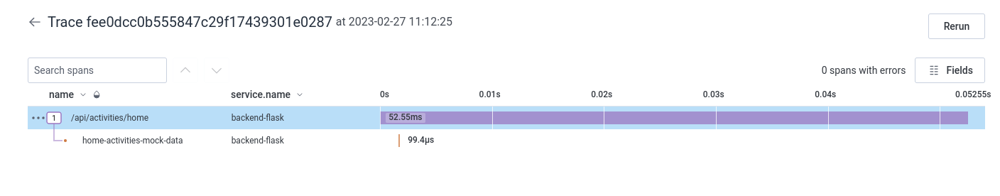
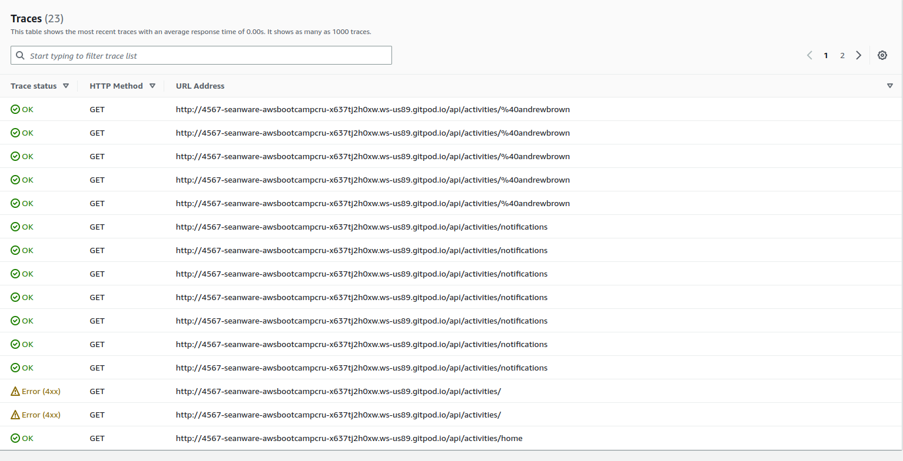
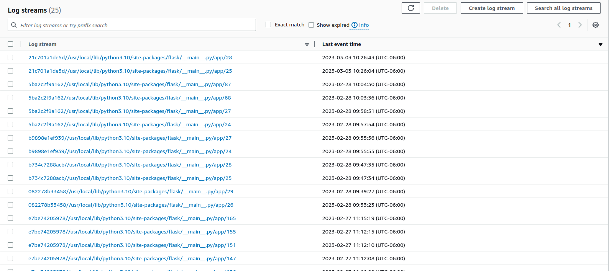
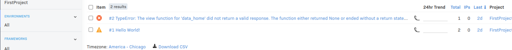
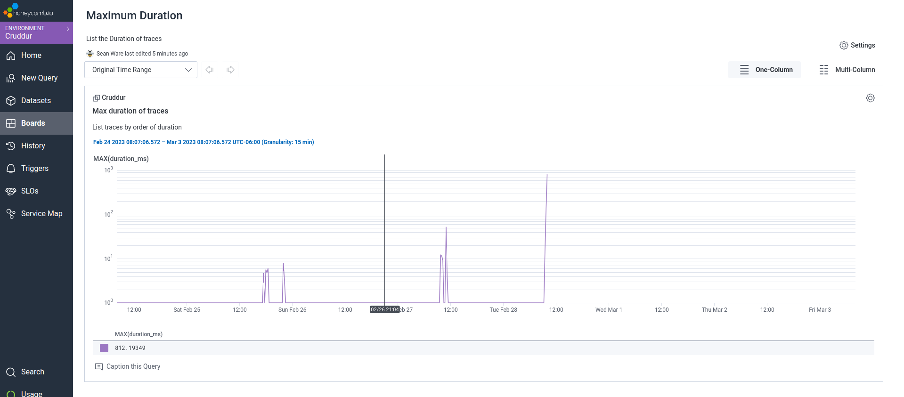

# Week 2 --- Distributed Tracing

### Objectives

The goal of this week was to implement distributed tracing on the backend of the Cruddur app so we can monitor the app while in production.  We used four different applications to monitor Cruddur and each one has strengths and weaknesses.

### Honeycomb

The first observability tool implemented was Honeycomb.io which is a managed monitoring service that uses the OpenTelemetry Standard for monitoring. OpenTelemetry creates both a single open standard for telemetry data and the technology to collect and export data from cloud-native applications so it can be monitored and analyzed. [1]

Since honeycomb is a managed service, I had to sign-up for using my github account a be given a HONEYCOMB_API_KEY.  

I modified my docker compose file to include the following environment variables
```yaml
OTEL_EXPORTER_OTLP_ENDPOINT: "https://api.honeycomb.io/"
OTEL_EXPORTER_OTLP_HEADERS: "x-honeycomb-team=${HONEYCOMB_API_KEY}"
OTEL_SERVICE_NAME: "backend-flask"
```

Next I installed opentelemetry and its associated libraries in the backend flask app with the following code.
```python
opentelemetry-api==1.16.0
opentelemetry-exporter-otlp-proto-http==1.16.0
opentelemetry-instrumentation==0.37b0
opentelemetry-instrumentation-flask==0.37b0
opentelemetry-instrumentation-requests==0.37b0
opentelemetry-instrumentation-wsgi==0.37b0
opentelemetry-proto==1.16.0
opentelemetry-sdk==1.16.0
opentelemetry-semantic-conventions==0.37b0
opentelemetry-util-http==0.37b0
```

I have to add code to the app.py file to implement the instrumentation

1. Import the OpenTelemtry libraries
```python
from opentelemetry import trace
from opentelemetry.instrumentation.flask import FlaskInstrumentor
from opentelemetry.instrumentation.requests import RequestsInstrumentor
from opentelemetry.exporter.otlp.proto.http.trace_exporter import OTLPSpanExporter
from opentelemetry.sdk.trace import TracerProvider
from opentelemetry.sdk.trace.export import BatchSpanProcessor
from opentelemetry.sdk.trace.export import ConsoleSpanExporter, SimpleSpanProcessor
```
2. Initialize the monitoring
```python
provider = TracerProvider()
processor = BatchSpanProcessor(OTLPSpanExporter())
provider.add_span_processor(processor)

...

FlaskInstrumentor().instrument_app(app)
RequestsInstrumentor().instrument()
```
3. Add spans to the home activities service
```python
from opentelemetry import trace

tracer = trace.get_tracer("home.activities")

...

span.set_attribute("app.result_length", len(results))
```

Here is an example of a trace


### Amazon X-ray

I implemented Amazon X-ray as a monitoring tool for Cruddur and it had a more involved installation than the other tools as it requires setting up a daemon server.  

First step is to install the X-ray SDK into python 
```python
aws-xray-sdk==2.11.0
```

Since x-ray requires a daemon server I had to create a docker image for the server and add the following to my docker compose file
```yaml
xray-daemon:
    image: "amazon/aws-xray-daemon"
    environment:
      AWS_ACCESS_KEY_ID: "${AWS_ACCESS_KEY_ID}"
      AWS_SECRET_ACCESS_KEY: "${AWS_SECRET_ACCESS_KEY}"
      AWS_REGION: "us-east-2"
    command:
      - "xray -o -b xray-daemon:2000"
    ports:
      - 2000:2000/udp
```

Adding instrumentation to the backend first requires adding the appropriate environment variables to the docker compose file
```yaml
AWS_XRAY_URL: "*4567-${GITPOD_WORKSPACE_ID}.${GITPOD_WORKSPACE_CLUSTER_HOST}*"
AWS_XRAY_DAEMON_ADDRESS: "xray-daemon:2000"
```

Create and x-ray group for logging events
```bash
aws xray create-group \
   --group-name "Cruddur" \
   --filter-expression "service(\"backend_flask\")"
```

The x-ray sampling rate is configured by a json file
```json
{
    "SamplingRule": {
        "RuleName": "Cruddur",
        "ResourceARN": "*",
        "Priority": 9000,
        "FixedRate": 0.1,
        "ReservoirSize": 5,
        "ServiceName": "backend-flask",
        "ServiceType": "*",
        "Host": "*",
        "HTTPMethod": "*",
        "URLPath": "*",
        "Version": 1
    }
  }
```

Implementation of the sampling rule requires the following command
```bash
aws xray create-sampling-rule --cli-input-json file://aws/json/xray.json
```

Code must be added to the app.py file to implement AWS Instrumentation as it was with honeycomb

1. Import x-ray libraries
```python
from aws_xray_sdk.core import xray_recorder
from aws_xray_sdk.ext.flask.middleware import XRayMiddleware
```

2. Initialize X-ray middleware object
```python
xray_url = os.getenv("AWS_XRAY_URL")
xray_recorder.configure(service='backed-flask', dynamic_naming=xray_url)
XRayMiddleware(app, xray_recorder)
```

3. Create traces and spans on the appropriate services. user_activities.py
```python
segment = xray_recorder.begin_segment('user_activities')
```



**CAUTION:** 

When running the docker containers with x-ray in the compose file, I did not see port:2000 on my ports tab. However, when checking the logs for that container I saw packages were being sent to the daemon. 

Also, my gitpod was having issues with the environment variables in xray.  It required me to restart the instance to achieve proper functionality.

### Cloud Watch Logging

Logging is a standard feature of most productions applications and AWS provides a service called CloudWatch logging. This service collects logs from our backend api using the AWS watchtower library.

Install Library
```python
pip install watchtower
```

The code for backend app needs to be modified to account for logging

1. Import the libraries to the app.py file
```python
from time import strftime
import watchtower
import logging
```

2. Configure the logger object
```python
LOGGER = logging.getLogger(__name__)
LOGGER.setLevel(logging.DEBUG)
console_handler = logging.StreamHandler()
cw_handler = watchtower.CloudWatchLogHandler(log_group='cruddur')
LOGGER.addHandler(console_handler)
LOGGER.addHandler(cw_handler)
LOGGER.info("test-log")
```

3. Add logging functionality to the app.py file
```python
@app.after_request
def after_request(response):
    timestamp = strftime('[%Y-%b-%d %H:%M]')
    LOGGER.error('%s %s %s %s %s %s', timestamp, request.remote_addr, request.method, request.scheme, request.full_path, response.status)
    return response
``` 
4. Add logging to the home_activities route
```python
def run(logger):
    logger.info("HomeActivities")
```


**Cost Concerns**

X-ray ad CloudWatch logging consume AWS resources and it is recommended that this functionality is disable during development to save costs.

### Rollbar

Rollbar is a error reporting service that we are can use to monitor our app for errors in real time.

I signed up for the rollbar service to create an api key so my backend would have access to the service. 

Add the access token to the docker compose file
```yaml
ROLLBAR_ACCESS_TOKEN: "${ROLLBAR_ACCESS_TOKEN}"
```

Installation of rollbar libaries requies rollbar and blinker packages.
```python
rollbar==0.16.3
blinker==1.5
```

1. Import Rollbar libraries to app.py
```python
import rollbar
import rollbar.contrib.flask
```

2. Since I am logging flask errors I need to import the flask function for getting exceptions
```python
from flask import got_request_exception
```
3. Rollbar needs to be testes and initialized before the first request is made
```python
@app.route('/rollbar/test')
def rollbar_test():
    rollbar.report_message('Hello World!', 'warning')
    return "Hello World!"

rollbar_access_token = os.getenv('ROLLBAR_ACCESS_TOKEN')
@app.before_first_request
def init_rollbar():
    """init rollbar module"""
    rollbar.init(
        # access token
        rollbar_access_token,
        # environment name
        'production',
        # server root directory, makes tracebacks prettier
        root=os.path.dirname(os.path.realpath(__file__)),
        # flask already sets up logging
        allow_logging_basic_config=False)

    # send exceptions from `app` to rollbar, using flask's signal system.
    got_request_exception.connect(rollbar.contrib.flask.report_exception, app)

```



### Challenge Problems

Honeycomb has a sophisticated query interface that is loosely SQL based and can used be create reports based on spans, traces, errors and more.

Honeycomb has a feature called boards that grants the user the ability to save the results of a query in a format that is useful for reporting information to the rest of the team.



A board can be created based on any query created in honeycomb

### References

1. https://cloud.google.com/learn/what-is-opentelemetry

