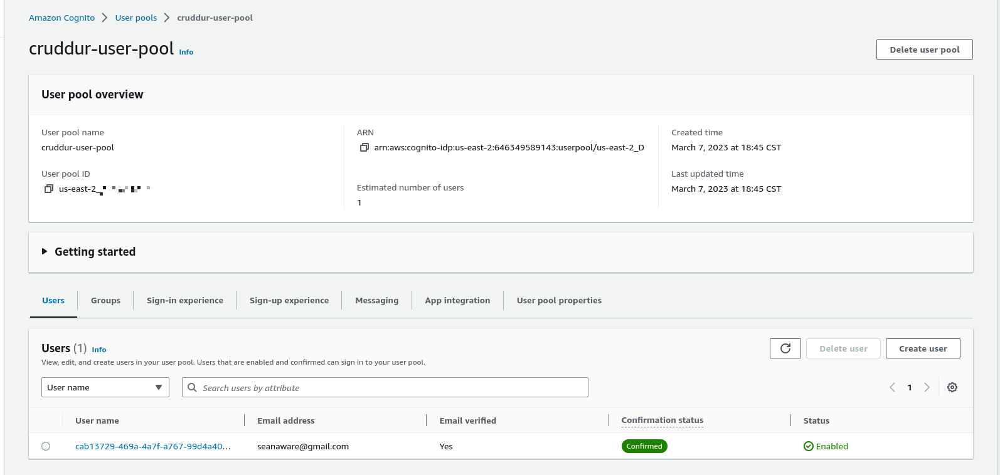

# Week 3 --Decentralized Authentication

### Objectives

In applications with microservice architectures, authentication is done very differently than monolithic apps.  These types or apps are better served using decentralized authentication services.  A decentralized authentication service handle the user verification and password handling for a distributed app.  
In Amazon, this service is called Cognito and was implemented to authenticate users in our Cruddur app using JWT tokens.

### Creating a User pool

I logged into the aws management console and created a user-pool, which is a place where our app user's credentials will be managed.

1. Create a cruddur-user-pool
2. Provide a Authentication Provider email
3. Use the Cognito Defaults for the password policy
4. We won't setup MFA and only use email communication due to cost concerns




### Add Authentication to the frontend

The frontend react-app had authentication implemented using the AWS supported Amplify sdk for node. 

1. Install aws-amplify on the frontend
```sh
npm i aws-amplify --save
```
2. Add athentication in the app.js frontend by importing amplify library
```js
import { Amplify } from 'aws-amplify';
```
3. Configure the amplify credentials
```js
Amplify.configure({
  "AWS_PROJECT_REGION": process.env.REACT_AWS_PROJECT_REGION,
  //"aws_cognito_identity_pool_id": process.env.REACT_APP_AWS_COGNITO_IDENTITY_POOL_ID,
  "aws_cognito_region": process.env.REACT_APP_AWS_COGNITO_REGION,
  "aws_user_pools_id": process.env.REACT_APP_AWS_USER_POOLS_ID,
  "aws_user_pools_web_client_id": process.env.REACT_APP_CLIENT_ID,
  "oauth": {},
  Auth: {
    // We are not using an Identity Pool
    // identityPoolId: process.env.REACT_APP_IDENTITY_POOL_ID, // REQUIRED - Amazon Cognito Identity Pool ID
    region: process.env.REACT_AWS_PROJECT_REGION,           // REQUIRED - Amazon Cognito Region
    userPoolId: process.env.REACT_APP_AWS_USER_POOLS_ID,         // OPTIONAL - Amazon Cognito User Pool ID
    userPoolWebClientId: process.env.REACT_APP_CLIENT_ID,   // OPTIONAL - Amazon Cognito Web Client ID (26-char alphanumeric string)
  }
});
```
4. Install amplify library in homepage.js file and update the check auth function
```js
const checkAuth = async () => {
    Auth.currentAuthenticatedUser({
      // Optional, By default is false. 
      // If set to true, this call will send a 
      // request to Cognito to get the latest user data
      bypassCache: false 
    })
    .then((user) => {
      console.log('user',user);
      return Auth.currentAuthenticatedUser()
    }).then((cognito_user) => {
        setUser({
          display_name: cognito_user.attributes.name,
          handle: cognito_user.attributes.preferred_username
        })
    })
    .catch((err) => console.log(err));
  };
```

5. Implement authentication in the SignIn page
```js
const onsubmit = async (event) => {
    setErrors('')
    event.preventDefault();    
      Auth.signIn(email, password)
        .then(user => {
          localStorage.setItem("access_token", user.signInUserSession.accessToken.jwtToken)
          window.location.href = "/"
        })
        .catch(error => { 
          if (error.code == 'UserNotConfirmedException') {
          window.location.href = "/confirm"
        }  
        setErrors(error.message)
      });      
    return false
  }
```

6. Implement authentication in the SignUp page
```js
 const onsubmit = async (event) => {
    setErrors('')
    event.preventDefault();    
      Auth.signIn(email, password)
        .then(user => {
          localStorage.setItem("access_token", user.signInUserSession.accessToken.jwtToken)
          window.location.href = "/"
        })
        .catch(error => { 
          if (error.code == 'UserNotConfirmedException') {
          window.location.href = "/confirm"
        }  
        setErrors(error.message)
      });      
    return false
  }
```

7. Implement authentication in the password recovery page
```js
 const onsubmit_send_code = async (event) => {
    event.preventDefault();
    setErrors('')
    Auth.forgotPassword(username)
    .then((data) => setFormState('confirm_code') )
    .catch((err) => setErrors(err.message) );
    return false
  }

  const onsubmit_confirm_code = async (event) => {
  event.preventDefault();
  setErrors('')
  if (password == passwordAgain){
    Auth.forgotPasswordSubmit(username, code, password)
    .then((data) => setFormState('success'))
    .catch((err) => setErrors(err.message) );
  } else {
    setErrors('Passwords do not match')
  }
  return false
}
```

8. Implement authentication in the recovery page
```js
const resend_code = async (event) => {
    setErrors('')
    try {
      await Auth.resendSignUp(email);
      console.log('code resent successfully');
      setCodeSent(true)
    } catch (err) {
      // does not return a code
      // does cognito always return english
      // for this to be an okay match?
      console.log(err)
      if (err.message == 'Username cannot be empty'){
        setErrors("You need to provide an email in order to send Resend Activiation Code")   
      } else if (err.message == "Username/client id combination not found."){
        setErrors("Email is invalid or cannot be found.")   
      }
    }
  }

  const onsubmit = async (event) => {
    event.preventDefault();
    setErrors('')
    try {
      await Auth.confirmSignUp(email, code);
      window.location.href = "/"
    } catch (error) {
      setErrors(error.message)
    }
    return false
  }
```

9. In the docker-compose file add the user-pool environmental variables
```yaml
REACT_APP_AWS_PROJECT_REGION:"${AWS_DEFAULT_REGION}"
REACT_APP_AWS_COGNITO_REGION:"${AWS_DEFAULT_REGION}"
REACT_APP_AWS_USER_POOLS_ID:"us-east-2#######"
REACT_APP_CLIENT_ID:"#############"
```

### Add backend Authentication using JWT tokens

JWT tokens are a standard way to handle authentication responsibilities in distributed applications.  These tokens allow identity verification to be passed securely from the frontend app to the backend with a third party in between.

1. Alter the homepage to pass JWT in the headers so the backend can receive the auth information
```js
const res = await fetch(backend_url, {
        headers: {
          Authorization: `Bearer ${localStorage.getItem("access_token")}`
        },
        method: "GET"
      });
```

2. Update the CORS on the app.py file to remove cors errors
```py
cors = CORS(
  app, 
  resources={r"/api/*": {"origins": origins}},
  headers=['Content-Type', 'Authorization'], 
  expose_headers='Authorization',
  methods="OPTIONS,GET,HEAD,POST"
)
```

The implementation of the backend requires installing a third-party library to the flask app.  This may present problems as the library in unsupported by AWS and may not be up to date. Also, we found that the library was to large and cumbersome for our needs so it was modified to suit our limited uses.

1. install the Flask-AWSCognito
```sh
pip install Flask-AWSCognito
```

2. Update the CORS of the app.py
```py
cors = CORS(
  app, 
  resources={r"/api/*": {"origins": origins}},
  headers=['Content-Type', 'Authorization'], 
  expose_headers='Authorization',
  methods="OPTIONS,GET,HEAD,POST"
)
```

3.  Add a new library that contains the contains the cognito verification functionality

4. Import the library into the python file
```py
from lib.cognito_jwt_token import CognitoJwtToken, extract_access_token, TokenVerifyError
```

5. Modify the data_home endpoint to receive token verification from AWS cognito
```py
def data_home():
  access_token = extract_access_token(request.headers)
  try:
    claims = cognito_jwt_token.verify(access_token)
    # authenicated request
    app.logger.debug("authenicated")
    app.logger.debug(claims)
    app.logger.debug(claims['username'])
    data = HomeActivities.run(cognito_user_id=claims['username'])
  except TokenVerifyError as e:
    # unauthenicated request
    app.logger.debug(e)
    app.logger.debug("unauthenicated")
    data = HomeActivities.run()
  return data, 200
```

6. Change the home service to accept cognito users ids and return a placeholder datastructure.
```py
def run(cognito_user_id=None):

...

if cognito_user_id != None:
        extra_crud = {
          'uuid': '248959df-3079-4947-b847-9e0892d1bab4',
          'handle':  'Lore',
          'message': 'My dear brother, it the humans that are the problem',
          'created_at': (now - timedelta(hours=1)).isoformat(),
          'expires_at': (now + timedelta(hours=12)).isoformat(),
          'likes': 1042,
          'replies': []
        }
```

