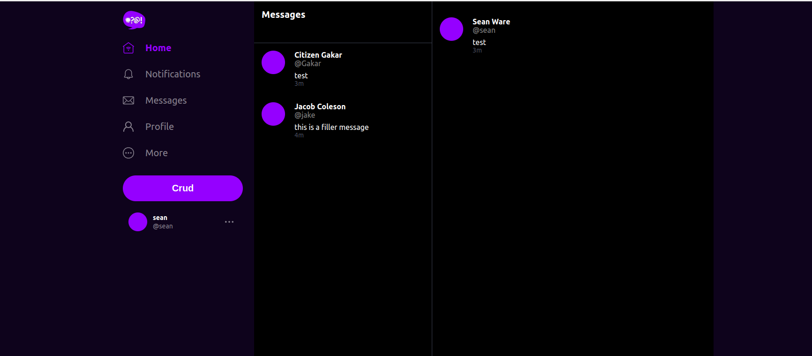

# Week 5 --- DynamoDB 
### Objectives

Implementation of the direct messaging will use dynamodb as a database to store the messages and groups of messages. DynamodDB was chosen as opposed to a relational database because this NoSQL is easier to scale with faster transactions than postgres. 

### Utility Scripts

Python scripts were created to interact with the local and staging dynamodb.  Boto3 is the AWS SDK for python and it has a robust set of functions to interact dynamodb.

Seven scripts were created to interact and setup the dynamodb instance. In the DDB folder the scripts are

- [drop](https://github.com/seanware/aws-bootcamp-cruddur-2023/blob/main/backend-flask/bin/ddb/drop)
- [list-tables](https://github.com/seanware/aws-bootcamp-cruddur-2023/blob/main/backend-flask/bin/ddb/list-tables)
- [scan](https://github.com/seanware/aws-bootcamp-cruddur-2023/blob/main/backend-flask/bin/ddb/scan)
- [schema-load](https://github.com/seanware/aws-bootcamp-cruddur-2023/blob/main/backend-flask/bin/ddb/schema-load)
- [seed](https://github.com/seanware/aws-bootcamp-cruddur-2023/blob/main/backend-flask/bin/ddb/seed)
- [patterns/get-conversations](https://github.com/seanware/aws-bootcamp-cruddur-2023/blob/main/backend-flask/bin/ddb/patterns/get-coversations)
- [patterns/list-conversations](https://github.com/seanware/aws-bootcamp-cruddur-2023/blob/main/backend-flask/bin/ddb/patterns/list-conversations)
- [cognito/list-users](https://github.com/seanware/aws-bootcamp-cruddur-2023/blob/main/backend-flask/bin/cognito/list-users)


To make a bash script that runs with python the file needs to have the following header to be able to run
```bash
#! /usr/bin/env python3
```


### Implement Direct Messages

The first step in implementing the direct messages is to creates a python class that implements the dynamodb tables for the message group and loads and unloads the data.

This file is located in is [lib/ddb](https://github.com/seanware/aws-bootcamp-cruddur-2023/blob/main/backend-flask/lib/ddb.py)

The schema for the messages was created in the ddb.py file
```py
my_message_group = {
      'pk': {'S': f"GRP#{my_user_uuid}"},
      'sk': {'S': last_message_at},
      'message_group_uuid': {'S': message_group_uuid},
      'message': {'S': message},
      'user_uuid': {'S': other_user_uuid},
      'user_display_name': {'S': other_user_display_name},
      'user_handle':  {'S': other_user_handle}
    }

other_message_group = {
      'pk': {'S': f"GRP#{other_user_uuid}"},
      'sk': {'S': last_message_at},
      'message_group_uuid': {'S': message_group_uuid},
      'message': {'S': message},
      'user_uuid': {'S': my_user_uuid},
      'user_display_name': {'S': my_user_display_name},
      'user_handle':  {'S': my_user_handle}
    }

message = {
      'pk':   {'S': f"MSG#{message_group_uuid}"},
      'sk':   {'S': created_at },
      'message': {'S': message},
      'message_uuid': {'S': message_uuid},
      'user_uuid': {'S': my_user_uuid},
      'user_display_name': {'S': my_user_display_name},
      'user_handle': {'S': my_user_handle}
    }
```

pk is the primary key for the table and sk in the sort key.  All of the keys are stored as S strings.

To access the local dynamodb from boto3, attributes we passed to the boto client
```py
def client():
    endpoint_url = os.getenv("AWS_ENDPOINT_URL")
   
    if endpoint_url:
      attrs = { 'endpoint_url': endpoint_url }
    else:
      attrs = {}
    dynamodb = boto3.client('dynamodb',**attrs)
    return dynamodb
```

The create_messages endpoint was updated to load the cognito token for the other user included in the message. It was also modified to fetch the user_receiver_handle from the frontend.

Frontend App.js
```js
{
    path: "/messages/new/:handle",
    element: <MessageGroupNewPage />
  },
```
The MessageForm.js file was modified to send parameters.
```js

import { json, useParams } from 'react-router-dom';
....

let json = { 'message': message  }
      if (params.handle) {
        json.handle = params.handle
      } else {
        json.message_group_uuid = params.message_group_uuid 
      }
....

 headers: {
          'Authorization': `Bearer ${localStorage.getItem("access_token")}`,
          'Accept': 'application/json',
          'Content-Type': 'application/json'

        },
```

MessageGroupFeed.js and MessageGroupItem.js were modified to take up message group parameters.

Also on the frontend, chechAuth function was abstracted away to its own file


Backend app.py

```py
def data_create_message():  
  
  access_token = extract_access_token(request.headers)
  user_receiver_handle = request.json.get('handle', None)
  message_group_uuid = request.json.get('message_group_uuid', None)
  message = request.json['message']
  try:
    claims = cognito_jwt_token.verify(access_token)
    # authenicatied request
    
    app.logger.debug("authenicated")
    app.logger.debug(claims)
    cognito_user_id = claims['sub']   
    if message_group_uuid == None:
      # Create for the first time
      model = CreateMessage.run(
        mode="create",
        message=message,
        cognito_user_id=cognito_user_id,
        user_receiver_handle= user_receiver_handle
      )
    else:
      # Push onto existing Message Group
      model = CreateMessage.run(
        mode="update",
        message=message,
        message_group_uuid=message_group_uuid,
        cognito_user_id=cognito_user_id
      )  
    if model['errors'] is not None:
      return model['errors'], 422
    else:
      return model['data'], 200
  except TokenVerifyError as e:
    # unauthenicatied request
    app.logger.debug(e)    
    return {}, 401    
```

The create message service was modified to update and create messages in the dynamodb table
```py
def run(mode, message, cognito_user_id, message_group_uuid=None, user_receiver_handle=None):

.......

      my_user    = next((item for item in users if item["kind"] == 'sender'), None)
      other_user = next((item for item in users if item["kind"] == 'recv')  , None)

      ddb = Ddb.client()

      if (mode == "update"):
        data = Ddb.create_message(
          client=ddb,
          message_group_uuid=message_group_uuid,
          message=message,
          my_user_uuid=my_user['uuid'],
          my_user_display_name=my_user['display_name'],
          my_user_handle=my_user['handle']
        )
      elif (mode == "create"):
        data = Ddb.create_message_group(
          client=ddb,
          message=message,
          my_user_uuid=my_user['uuid'],
          my_user_display_name=my_user['display_name'],
          my_user_handle=my_user['handle'],
          other_user_uuid=other_user['uuid'],
          other_user_display_name=other_user['display_name'],
          other_user_handle=other_user['handle']
        )

       model['data'] = data   
      
```

The messages service was also modified
```py
def run(message_group_uuid, cognito_user_id):
    ......

    ddb = Ddb.client()
    data = Ddb.list_messages(ddb, message_group_uuid)   

    model['data'] = data
```

The message groups needs to be fetched from the db
```py
ddb = Ddb.client()
data = Ddb.list_message_groups(ddb, my_user_uuid)
    
model['data'] = data
```

A new service was created to get the short handle for the user from the db. users_short.py
```py
from lib.db import db

class UsersShort:
  def run(handle):
    sql = db.template('users','short')
    results = db.query_object_json(sql,{
      'handle': handle
    })
    return results
```

The app.py file has the users_short route implemented
```py
@app.route("/api/users/@<string:handle>/short", methods=['GET'])
def data_users_short(handle):
  data = UsersShort.run(handle)
  return data, 200
```

A new user needed to be added to the dev postgres database for testing
```sql
INSERT INTO public.users (display_name, handle, email, cognito_user_id)
....
('Jacob Coleson', 'jake', 'alterego@mail.com', 'MOCK'),
  ('Citizen Gakar', 'Gakar', 'gakar@narn.com', 'MOCK' );
```

The development database was seeded with messaging data with a utility python script.


### Implement Message updates

Message updates were implemented using DDB streams which are updated with a lambda functions

A production DynamoDB was created with a table named cruddur-messages

A lambda function was created to load new messages in the database and remove older messages due to the fact that dynamodb has no update functionality.

[create-messaging-streams.py](https://github.com/seanware/aws-bootcamp-cruddur-2023/blob/main/aws/lambdas/cruddur-messaging-stream.py)

The trigger for the lambda is DB streams and a VPC Gateway endpoint was created so the lambda could access the app and the database.

Update the permissions of the lambda function to include:

- AWSLamdaInvocate-Dynamodb
- Inline policy for puts and deletes [Link](https://github.com/seanware/aws-bootcamp-cruddur-2023/blob/main/aws/json/policy/cruddur-stream-messaging-policy.json)


