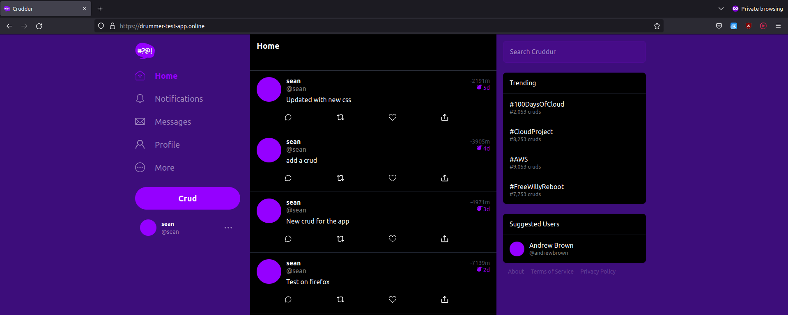
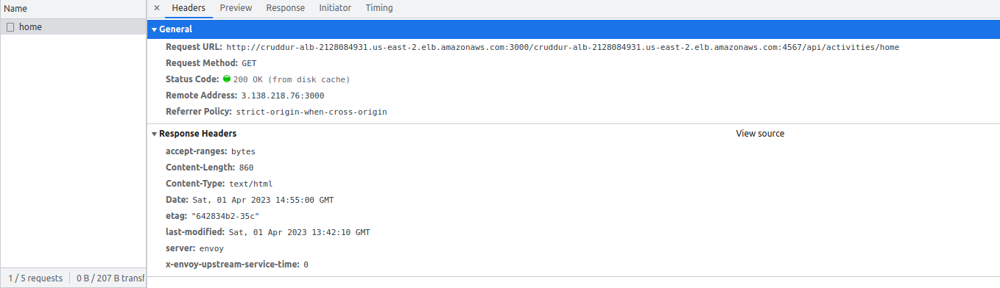
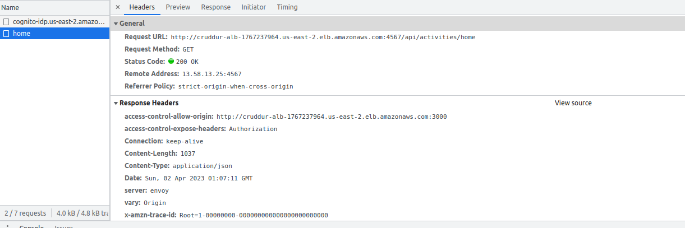

# Week 7 — Solving CORS with a Load Balancer and Custom Domain

*Motivation*

Put the ECS services behind and load balancer to manage traffic and create routes behind our domain name.

SITE NAME: [drummer-test-app.online](https://drummer-test-app.online/)



### Create Application Load Balancer

*Trouble Shooting*

A Request URL error was encountered on the frontend of the app when the incorrect backend route was displayed


Had to tear down the load balancer and create a new one to fix the error


Second Load Balancer behind a security group


### Create Security Group for load Balancer


### Create Target Groups


### Use Route53 for custom Domain


Hosted zones


### Setup monitoring in the Containers

*X-ray*

To setup monitoring in the tasks an x-ray container was added to the task definitions to attempt enable Container Insights
```js
{
      "name": "xray",
      "image": "public.ecr.aws/xray/aws-xray-daemon" ,
      "essential": true,
      "user": "1337",
      "portMappings": [
        {
          "name": "xray",
          "containerPort": 2000,
          "protocol": "udp"
        }
      ]
    },
```

### Docker bridge network

A user defined bridge network was created to allow the containers to communicate with each other whether use docker-compose on that container or not.
```sh
docker network create cruddur-net
```

Also, the docker-compose.yml file was update to use docker-network
```yml
networks: 
  cruddur-net:
    driver: bridge
    name: cruddur-net
```


