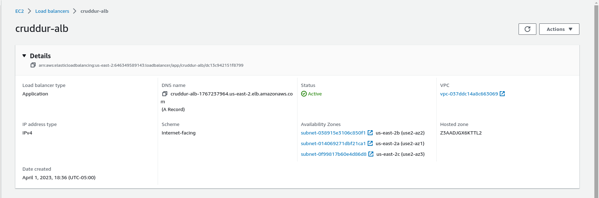
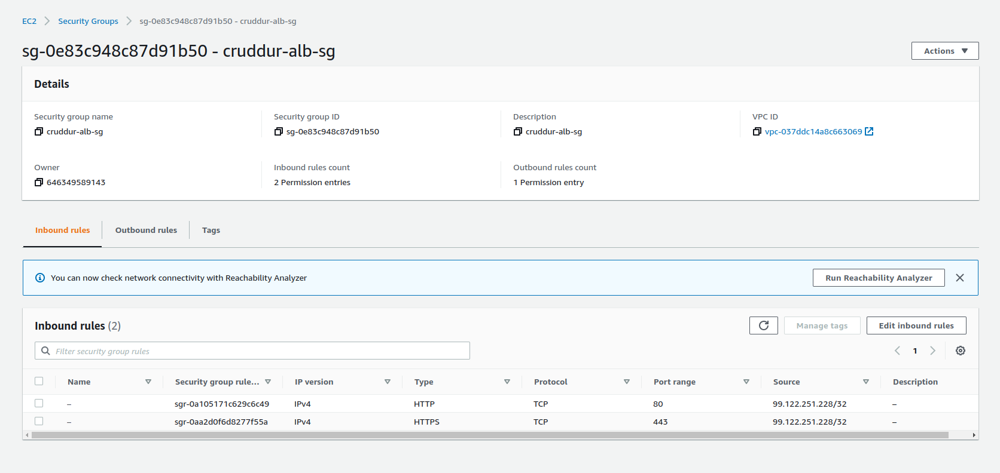
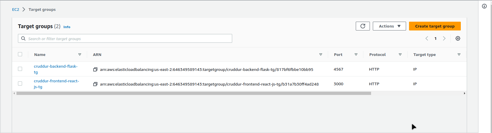
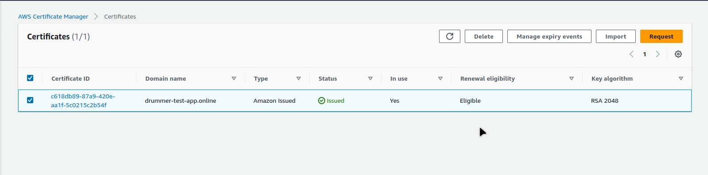
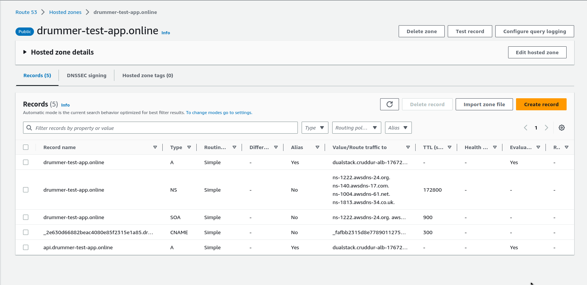

# Week 7 — Solving CORS with a Load Balancer and Custom Domain

*Motivation*

Put the ECS services behind and load balancer to manage traffic and create routes behind our domain name.

SITE NAME: [drummer-test-app.online](https://drummer-test-app.online/)

### Create Application Load Balancer



### Create Security Group for load Balancer



### Create Target Groups



### Use Route53 for custom Domain



Hosted zones



### Setup monitoring in the Containers

*X-ray*

To setup monitoring in the tasks an x-ray container was added to the task definitions to attempt enable Container Insights
```js
{
      "name": "xray",
      "image": "public.ecr.aws/xray/aws-xray-daemon" ,
      "essential": true,
      "user": "1337",
      "portMappings": [
        {
          "name": "xray",
          "containerPort": 2000,
          "protocol": "udp"
        }
      ]
    },
```

### Docker bridge network


