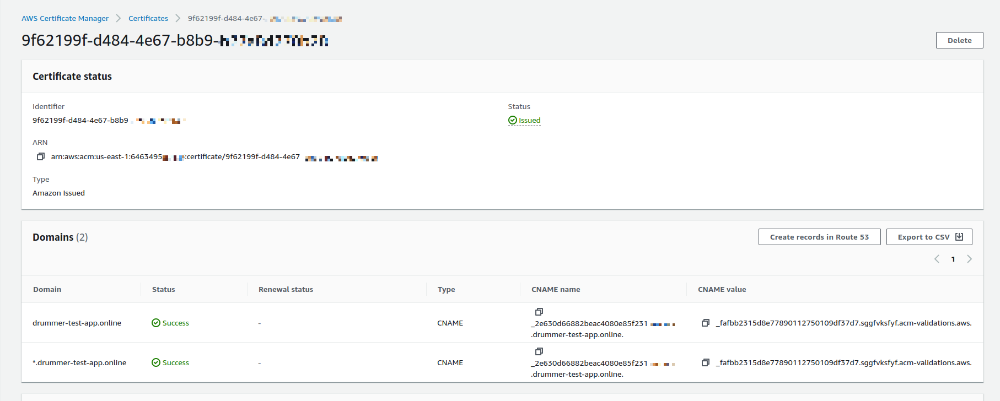
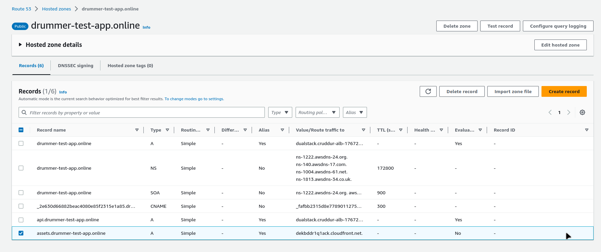
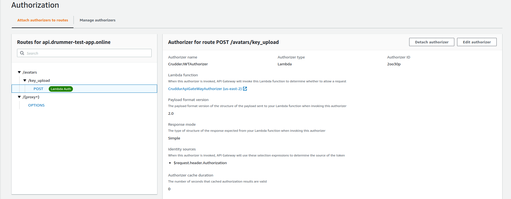

# Week 8 — Serverless Image Processing

### Motivations

The ability to modify the user profile by uploading images to S3 was implemented using lambda functions and placed behind API Gateway. Many of these processed were implemented using Amazon's CDK to automate the deployment. Code for [AWS CDK](https://docs.aws.amazon.com/cdk/v2/guide/home.html) was written in [Typescript.js](https://www.typescriptlang.org/).


###  AWS CDK

*Initial Setup*

AWS Cloud Developer Kit was installed in the thumbing-serverless-cdk directory
```sh
npm install aws-cdk -g
```
This must be installed in the the directory and in the top-level

Create a project skeleton the cdk command
```sh
cdk init app --language typescript
```

Bootstrapping is the deployment of an AWS CloudFormation template to a specific AWS environment (account and Region)
```sh
cdk bootstrap "aws://$AWS_ACCOUNT_ID/$AWS_DEFAULT_REGION"
```

*Create the buckets*

A bucket was created  uploaded to photos in the thumbing-serverless-cdk-stack.ts file

```js
import * as s3 from 'aws-cdk-lib/aws-s3'
const uploadBucket = this.createBucket(uploadBucketName);

....

createBucket(bucketName: string): s3.IBucket {
    const logicalName: string = 'staging';
    const bucket = new s3.Bucket(this, logicalName , {
      bucketName: bucketName,
      removalPolicy: cdk.RemovalPolicy.DESTROY,
    });
    return bucket;
  }
```

The assets bucket was create from the console so it would not disappear when the template was destroyed. It was accessed using the following code
```js
const assetsBucket = this.importBucket(assetsBucketName);

....

importBucket(bucketName: string): s3.IBucket {
    const bucket = s3.Bucket.fromBucketName(this,"AssetsBucket",bucketName);
    return bucket;
  }
```
Bucket names

```sh
UPLOADS_BUCKET_NAME="uploads.drummer-test-app"
THUMBING_BUCKET_NAME="assets.drummer-test-app"
```
To get a preview of the yaml files and the CloudFormation template that will be create when the cdk is deployed, the following commands are run
```sh
cdk synth
```

The cdk is deployed
```sh
cdk deploy
``` 
And the CloudFormation Template is checked from the console to confirm if the assets have been deployed.

*Creating the lambda function*

AWS Cloud Developer Kit was used to deploy the lambda function that processes the image, making sure it is the correct size using the sharp.js library. It is triggered when an image is uploaded to the upload bucket. [Processing Lambda](https://github.com/seanware/aws-bootcamp-cruddur-2023/tree/main/aws/lambdas/process-images)

To implement the lambda function, the sharp.js library had to be installed in te aws/lambdas/process-images path
```sh
npn init -y 
npm i @aws-sdk/client-s3 
```

The thumbing-serverless-cdk-stack.ts file needed access to the environment variables so the dotenv library was installed load envs from a .env file
```sh
npm i dotenv
```
The following code was used in the thumbing-serverless-cdk-stack.ts
```js
import * as dotenv from 'dotenv';
dotenv.config();
```

The code for the lambda function in the cdk is below
```js
import * as lambda from 'aws-cdk-lib/aws-lambda';

const lambda = this.createLambda(folderInput,folderOutput,functionPath,assetsBucketName)

createLambda(folderInput: string, folderOutput: string, functionPath: string, bucketName: string): lambda.IFunction {
  const logicalName = 'ThumbLambda';
  const code = lambda.Code.fromAsset(functionPath)
  const lambdaFunction = new lambda.Function(this, logicalName, {
    runtime: lambda.Runtime.NODEJS_18_X,
    handler: 'index.handler',
    code: code,
    environment: {
      DEST_BUCKET_NAME: bucketName,
      FOLDER_INPUT: folderIntput,
      FOLDER_OUTPUT: folderOutput,
      PROCESS_WIDTH: '512',
      PROCESS_HEIGHT: '512'
    }
  });
  return lambdaFunction;
}
```

The lambda function was granted permission to the buckets
```js
import * as s3n from 'aws-cdk-lib/aws-s3-notifications';
import * as sns from 'aws-cdk-lib/aws-sns';
import * as subscriptions from 'aws-cdk-lib/aws-sns-subscriptions';

const s3UploadsReadWritePolicy = this.createPolicyBucketAccess(uploadBucket.bucketArn)
const s3AssetsReadWritePolicy = this.createPolicyBucketAccess(assetsBucket.bucketArn)

lambda.addToRolePolicy(s3UploadsReadWritePolicy);
lambda.addToRolePolicy(s3AssetsReadWritePolicy);

createPolicyBucketAccess(bucketArn: string){
    const s3ReadWritePolicy = new iam.PolicyStatement({
      actions: [
        's3:GetObject',
        's3:PutObject',
      ],
      resources: [
        `${bucketArn}/*`,
      ]
    });
    return s3ReadWritePolicy;
  }
```

The lambda trigger was implemented on the upload assets bucket
```js
import * as iam from 'aws-cdk-lib/aws-iam';

lambda.addToRolePolicy(s3UploadsReadWritePolicy);
lambda.addToRolePolicy(s3AssetsReadWritePolicy);

createS3NotifyToLambda(prefix: string, lambda: lambda.IFunction, bucket: s3.IBucket): void {
    const destination = new s3n.LambdaDestination(lambda);
    bucket.addEventNotification(
      s3.EventType.OBJECT_CREATED_PUT,
      destination//,
      //{prefix: prefix} // folder to contain the original images
    )
  }
```

SNS topic, subscriptions, and notifications
```js
const snsTopic = this.createSnsTopic(topicName)
this.createSnsSubscription(snsTopic,webhookUrl)
    

this.createS3NotifyToLambda(folderInput,lambda,uploadBucket)
this.createS3NotifyToSns(folderOutput,snsTopic,assetsBucket)

createS3NotifyToSns(prefix: string, snsTopic: sns.ITopic, bucket: s3.IBucket): void {
    const destination = new s3n.SnsDestination(snsTopic)
    bucket.addEventNotification(
      s3.EventType.OBJECT_CREATED_PUT, 
      destination,
      {prefix: prefix}
    );
  }

  createSnsTopic(topicName: string): sns.ITopic{
    const logicalName = "ThumbingTopic";
    const snsTopic = new sns.Topic(this, logicalName, {
      topicName: topicName
    });
    return snsTopic;
  }

  createSnsSubscription(snsTopic: sns.ITopic, webhookUrl: string): sns.Subscription {
    const snsSubscription = snsTopic.addSubscription(
      new subscriptions.UrlSubscription(webhookUrl)
    )
    return snsSubscription;
  }
  ```

  When there were issues and the CDK needs to be destroyed 
  ```sh
  cdk destroy
  ```
*Bucket Architecture*

The assets bucket uses te following architecture 

avatars/uploads/

avatars/processed/

Names of the buckets and other environment variables were stored in a file called .env.images-lambda and cdk uses this file to create an .env to load the environment variables

*Utility Scripts*

To load and delete images in the S3 buckets from the command line two utility scripts were created.

upload
```sh
#! /usr/bin/bash

ABS_PATH=$(readlink -f "$0")
SERVERLESS_PATH=$(dirname $ABS_PATH)
DATA_FILE_PATH="$SERVERLESS_PATH/files/data.jpg"

echo "s3://uploads.$DOMAIN_NAME/avatars/uploads/data.jpg"

aws s3 cp "$DATA_FILE_PATH" "s3://uploads.$DOMAIN_NAME/avatars/uploads/data.jpg"
```

clear
```sh
#! /usr/bin/bash

ABS_PATH=$(readlink -f "$0")
SERVERLESS_PATH=$(dirname $ABS_PATH)
DATA_FILE_PATH="$SERVERLESS_PATH/files/data.jpg"

aws s3 rm "s3://uploads.$DOMAIN_NAME/avatars/uploads/data.jpg"
aws s3 rm "s3://assets.$DOMAIN_NAME/avatars/processed/data.jpg"
```

Another script was created to install libraries for the processing lambda function

build
```sh
#! /usr/bin/bash

ABS_PATH=$(readlink -f "$0")
SERVERLESS_PATH=$(dirname $ABS_PATH)
BIN_PATH=$(dirname $SERVERLESS_PATH)
PROJECT_PATH=$(dirname $BIN_PATH)
SERVERLESS_PROJECT_PATH="$PROJECT_PATH/aws/lambdas/process-images"

cd $SERVERLESS_PROJECT_PATH

npm install
rm -rf node_modules/sharp
SHARP_IGNORE_GLOBAL_LIBVIPS=1 npm install --arch=x64 --platform=linux --libc=glibc sharp
```

### CloudFront

AWS CloudFront was used to serve bucket images over the internet.

CloudFront was setup using the AWS console with the following parameters:

- Origin domain : assets.drummer-test-app.s3.us-east-2.amazonaws.com

- Origin access control

- No origin shield

- Redirect to HTTPs

- GET,HEAD

- NO restriction of viewer access

- Cache policy : SimpleCORS


*SSL Certificate*

A new SSL certificate was created for the domains



*Bucket Permissions*

Permissions on the bucket need to be modified to allow for CloudFront access.

```json
{
    "Version": "2008-10-17",
    "Id": "PolicyForCloudFrontPrivateContent",
    "Statement": [
        {
            "Sid": "AllowCloudFrontServicePrincipal",
            "Effect": "Allow",
            "Principal": {
                "Service": "cloudfront.amazonaws.com"
            },
            "Action": "s3:GetObject",
            "Resource": "arn:aws:s3:::assets.drummer-test-app/*",
            "Condition": {
                "StringEquals": {
                    "AWS:SourceArn": "arn:aws:cloudfront::6463495#####:distribution/E14417J9OHQ5NI"
                }
            }
        }
    ]
}
```

*Route53*

A new record was created for the CloudFront assets bucket and added to the hosted zone for the app.



### Implement Users Profile Page

The users of the application need to be able to upload profile images from the site so this functionality was implemented on the usersfeedpage.

*Utility Scripts*

The .gitpod.yml was modified to generate environment variables upon startup of the gitpod workspace.  The following command was added to the frontend and backend commands

```yml
 ruby $THEIA_WORKSPACE_ROOT/bin/backend/generate-env
```

*Backend*

A show.sql script was created to fetch the user profile data from the backend database.

```sql
SELECT 
  (SELECT COALESCE(row_to_json(object_row),'{}'::json) FROM (
    SELECT
      users.uuid,
      users.handle,
      users.display_name,      
      users.bio,
      (
       SELECT 
        count(true) 
       FROM public.activities
       WHERE
        activities.user_uuid = users.uuid
       ) as cruds_count
  ) object_row) as profile,
  (SELECT COALESCE(array_to_json(array_agg(row_to_json(array_row))),'[]'::json) FROM (
    SELECT
      activities.uuid,
      users.display_name,
      users.handle,
      activities.message,
      activities.created_at,
      activities.expires_at
    FROM public.activities
    WHERE
      activities.user_uuid = users.uuid
    ORDER BY activities.created_at DESC 
    LIMIT 40
  ) array_row) as activities
FROM public.users
WHERE
  users.handle = %(handle)s
```

The backend flask app was updated to show the users profile data with the users_activites.py route

```py
sql = db.template('users','show')
results = db.query_object_json(sql,{'handle': user_handle})      
model['data'] = results
```
The lib.db file was updated to use verbose=True for the sql fetching statements

The users activities uses the following route:

```py
@app.route("/api/activities/@<string:handle>", methods=['GET'])
def data_handle(handle):
  model = UserActivities.run(handle)
  if model['errors'] is not None:
    return model['errors'], 422
  else:
    return model['data'], 200
```

*Frontend*

The user feed pages was modified to add an Edit Profile button. A new component and css were created for the profile button.

EditProfileButton.js
```js
import './EditProfileButton.css';

export default function EditProfileButton(props) {
  const pop_profile_form = (event) => {
    event.preventDefault();
    props.setPopped(true);
    return false;
  }

  return (
    <button onClick={pop_profile_form} className='profile-edit-button' href="#">Edit Profile</button>
  );
}
```
EditProfileButton.ccs
```css
.profile-edit-button {
    border: solid 1px rgba(255,255,255,0.5);
    padding: 12px 20px;
    font-size: 18px;
    background: none;
    border-radius: 999px;
    color: rgba(255,255,255,0.8);
    cursor: pointer;
  }
  
  .profile-edit-button:hover {
    background: rgba(255,255,255,0.3);
  }
```

The following components and pages were modified to load user activities:

- ActivityFeed.js
- CrudButton.js
- HomeFeedPage.js
- NotificationsFeedPage.js
- UserFeedPage.js


In the UserFeedPage.js the @ sign was added back to the endpoint @{params.handle}

```js
const backend_url = `${process.env.REACT_APP_BACKEND_URL}/api/activities/@${params.handle}
```

A new component was created for the profile headers to display the image avatars
- ProfileHeading.js
- ProfileHeading.css

The background image was stored in the assets bucket at "https://assets.drummer-test-app.online/banners/banner.jpg"

### Database Migrations

Bio columns need to be added to the database so the best solution to used was to add db migration scripts.

The update.sql file was added to add the bio columns
```sql
UPDATE public.users 
SET 
  bio = %(bio)s,
  display_name= %(display_name)s
WHERE 
  users.cognito_user_id = %(cognito_user_id)s
RETURNING handle;
```

Migration Scripts were created using python to migrate and rollback the changes in the database

bin/db/[migrate](https://github.com/seanware/aws-bootcamp-cruddur-2023/blob/main/bin/db/migrate)
bin/db/[rollback](https://github.com/seanware/aws-bootcamp-cruddur-2023/blob/main/bin/db/rollback)

When the migration script is run a load script is created on the backend with a timestamp.

### Client Side Uploads

A presigned url is fetched from the S3 bucket using a lambda written in Ruby name CruddurAvatarUpload

```rb
require 'aws-sdk-s3'
require 'json'
require 'jwt'

def handler(event:, context:)
  puts event
  # return cors headers for preflight check
  if event['routeKey'] == "OPTIONS /{proxy+}"
    puts({step: 'preflight', message: 'preflight CORS check'}.to_json)
    { 
      headers: {
        "Access-Control-Allow-Headers": "*, Authorization",
        "Access-Control-Allow-Origin": "<gitpod url>", #not good technique to ard code values
        "Access-Control-Allow-Methods": "OPTIONS,GET,POST"
      },
      statusCode: 200
    }
  else
    token = event['headers']['authorization'].split(' ')[1]
    puts({step: 'presignedurl', access_token: token}.to_json)

    body_hash = JSON.parse(event["body"])
    extension = body_hash["extension"]

    decoded_token = JWT.decode token, nil, false
    cognito_user_uuid = decoded_token[0]['sub']

    s3 = Aws::S3::Resource.new
    bucket_name = ENV["UPLOADS_BUCKET_NAME"]
    object_key = "#{cognito_user_uuid}.#{extension}"

    puts({object_key: object_key}.to_json)

    obj = s3.bucket(bucket_name).object(object_key)
    url = obj.presigned_url(:put, expires_in: 60 * 5)
    url # this is the data that will be returned
    body = {url: url}.to_json
    { 
      headers: {
        "Access-Control-Allow-Headers": "*, Authorization",
        "Access-Control-Allow-Origin": "<gitpod url>",
        "Access-Control-Allow-Methods": "OPTIONS,GET,POST"
      },
      statusCode: 200, 
      body: body 
    }
  end 
end 
```

To implement this function a lambda layer was created that contained all the libraries necessary for the functions operation. This was delivered via bash script bin/lambda-layers/ruby-jwt

```sh
#! /usr/bin/bash

gem i jwt -Ni /tmp/lambda-layers/ruby-jwt/ruby/gems/2.7.0
cd /tmp/lambda-layers/ruby-jwt

zip -r lambda-layers . -x ".*" -x "*/.*"
zipinfo -t lambda-layers

aws lambda publish-layer-version \
  --layer-name jwt \
  --description "Lambda Layer for JWT" \
  --license-info "MIT" \
  --zip-file fileb://lambda-layers.zip \
  --compatible-runtimes ruby2.7
```

The lambda had PutObject permissions granted to it to access the S3 bucket which was granted with the PresignedUrlAvatarPolicy

The ProfileForm.js was modified to accept S3 uploads from the client

A function was implemented to fetch the presigned url

```js
const s3uploadkey = async (extension)=> {
    console.log('ext',extension)
    try {
      const gateway_url = `${process.env.REACT_APP_API_GATEWAY_ENDPOINT_URL}/avatars/key_upload`
      await getAccessToken()
      const access_token = localStorage.getItem("access_token")
      const json = {
        extension: extension
      }
      const res = await fetch(gateway_url, {
        method: "POST",
        body: JSON.stringify(json),
        headers: {
          'Origin': process.env.REACT_APP_FRONTEND_URL,
          'Authorization': `Bearer ${access_token}`,
          'Accept': 'application/json',
          'Content-Type': 'application/json'
        }
      })
      let data = await res.json();
      if (res.status === 200) {
        return data.url
        console.log("tst", res)
      } else {
        console.log(res)
      }
    } catch (err) {
      console.log(err);
    }
  }
```

Another function was implemented to load the image to the bucket using an onclick event.

```js
const s3upload = async (event)=> {
    console.log('event',event)
    const file = event.target.files[0]
    const filename = file.name
    const size = file.size
    const type = file.type
    const preview_image_url = URL.createObjectURL(file)
    console.log(filename,size,type)
    const fileparts = filename.split('.')
    const extension = fileparts[fileparts.length-1]
    const presignedurl = await s3uploadkey(extension)
    try {
      console.log('s3upload')
      const res = await fetch(presignedurl, {
        method: "PUT",
        body: file,
        headers: {
          'Content-Type': type
      }})
      if (res.status === 200) {
        
      } else {
        console.log(res)
      }
    } catch (err) {
      console.log(err);
    }
  }
```

Change event code
```html
<input type="file" name="avatarupload" onChange={s3upload} />
```

*Authorizer*

The users need to be Authorized via cognito before they are granted a presignedUrl to load their avatar. A lambda function was created using the aws-jwt-verify javascript library to verify the user tokens in AWS Cognito.

lambdas/lambda-authorizers/index.js

The library must be installed
```sh
npm install aws-jwt-verify --save
```

The files were zipped and upload to the lambda

*Troubleshooting CORS*

Due to the implementation of the Authorizer, the application experienced CORS issues that had to be dealt with by adding origins to the function.rb.


### API Gateway

The api was placed behind the Api Gateway so it provides a unified entry point across internal APIs.

The Gateway has the following attributes

- Name: api.drummer-test-app.online
- Invoke Url: https://ubkd1i4ebc.execute-api.us-east-2.amazonaws.com
- Routes: /avatars/key_upload  Method: POST
- Routes: /{proxy+}  METHOD OPTIONS

The key_upload route granted an Authorizer named CruddurJWTAuthorizer tat was set to the Authorizor lambda function with Simple URL and No caching.


The uploads bucket needed to be configure for CORS
```json
[
    {
        "AllowedHeaders": [
            "*"
        ],
        "AllowedMethods": [
            "PUT"
        ],
        "AllowedOrigins": [
            "https://*.gitpod.io"
        ],
        "ExposeHeaders": [
            "x-amz-server-side-encryption",
            "x-amz-request-id",
            "x-amz-id-2"
        ],
        "MaxAgeSeconds": 3000
    }
]
```

The REACT_API_GATEWAY_ENDPOINT_URL was saved as an environment variable to be loaded in the frontend.

*Avatar Component*

ProfileAvatar.js was created to load the avatar front the assets bucket

To load the cognito user id into the profile with the show.sql script.

```sql
SELECT
      users.uuid,
      users.handle,
      users.display_name,
      users.cognito_user_id as cognito_user_uuid,
      users.bio,
```

### Acknowledgments

I would like to thank user F4dy from the AWS Bootcamp discord for assistance in debugging the CORS issues in the CruddurAvatarUpload lambda.

