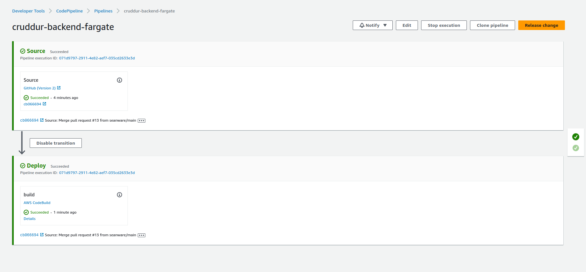
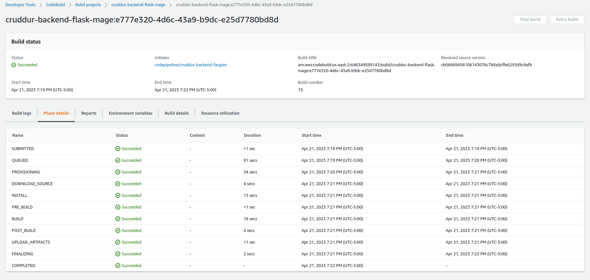

# Week 9 — CI/CD with CodePipeline, CodeBuild and CodeDeploy

*Motivations*

Continuos Integration and Continuos Development was implemented to ease the deployment of features to the application.  The first portion of the application that was automated was the backend flask app.  When the CI/CD pipeline is triggered the backend-flask docker container is updated in the Elastic Container Repository, which automatically updates AWS Fargate.

### Codepipeline Console

AWS Codepipeline was used to load and deploy the code from the Github repository containing the application

The name of the pipeline is __cruddur-backend-fargate__

When initially creating the pipeline all default options were accepted

*__Add Source stage__*

The Source stage watches the repo for changes and triggers the deploy stage on a change.

A production branch was created from the main branch and when this repo changes it will trigger the Codepipeline


Source Options:

- Github version 2
- Github Connection Name:  __github-connection__
- Use prod repo

Skip Build stage

The build stage was implemented with CodeBuild


*__Add Deploy Stage__*

The deploy stages listens for the new ECR container and loads it into Fargate

Deploy Options:

- Provider Amazon ECS
- Service: Backend Flask





### CodeBuild

AWS CodeBuild was used to create the backend service and load the container in the ECR so Fargate would be updated.

Build Options:

- Name: __cruddur-backend-flask-bake-image__
- Enable build badge 
- Source Provider: Github
- Source Version   Prod 
- Environment: Amazon Linux 2 
- Runtime: Standard
- Image: Latest image 
- Privileged : Must be checked for the Docker Containers to be deployed


A [buildspec.yml](https://github.com/seanware/aws-bootcamp-cruddur-2023/blob/main/backend-flask/buildspec.yml) file was required to be created for CodeBuild to function. 


The buildspec.yml filepath is 
```sh
aws-bootcamp-cruddur-2023/backend-flask/buildspec.yml
```

It is important that the proper filepath entered in the build configurations because CodeBuild defaults to the Root directory when looking for the YAML file.

*__Permissions__*

CodeBuild was granted ECR permissions to load the containers into the registry.




### HealthCheck

The health-check was update to version 1

```py
def health_check():
    return {'success': True, 'ver': 1}, 200
```


